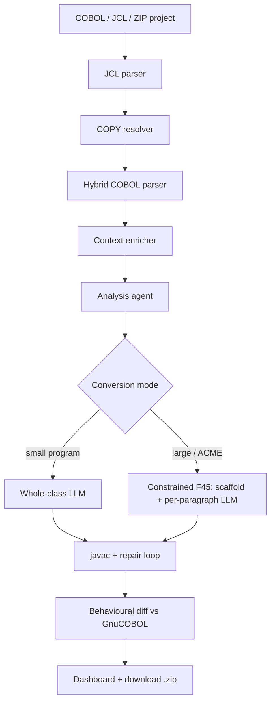

# COBOL Modernizer — AI-powered COBOL to Java pipeline

An end-to-end platform that modernizes legacy COBOL batch programs into production-ready
**plain Java** (no Spring by default). The system parses COBOL with a hybrid deterministic
parser, analyses business logic with an LLM-backed analysis agent, converts to Java using
one of two generation modes, compiles and repairs output, verifies behavioral equivalence
against GnuCOBOL execution, and surfaces results through a Next.js dashboard.

---

## Project structure

```
cobol/
├── README.md                         ← this file
├── RUN_GUIDE.md                      ← operator quickstart
├── start_backend.bat                 ← launches cobol-modernization-service on port 8010
├── start_frontend.bat                ← launches cobol-modernization-dashboard
├── .vscode/
│
├── docs/
│   ├── architecture/                 ← production architecture reference (EY review)
│   │   ├── ARCHITECTURE_README.md    ← start here: doc index + component map
│   │   ├── ARCH_00_SYSTEM_LOGIC.md
│   │   ├── ARCH_02_PARSER_ANALYSIS_CONVERSION_LOGIC.md
│   │   ├── ARCH_04_TESTING_VALIDATION_AND_DOWNLOAD_LOGIC.md
│   │   ├── ARCH_05_FRONTEND_BACKEND_INTERACTION.md
│   │   ├── SCHEMA_CONTRACTS.md
│   │   ├── DEVELOPER_GUIDE.md
│   │   └── … (layer specs, API contracts, diagrams)
│   │
│   └── dev-notes/                    ← internal iteration notes (not required for review)
│
├── cobol-modernization-service/      ← Python / FastAPI backend (active implementation)
│   ├── app/
│   │   ├── agents/                   ← AnalysisAgent, ConversionAgent
│   │   ├── api/                      ← REST routes under /api
│   │   ├── converters/               ← constrained generation, Java scaffolding
│   │   ├── core/                     ← AppConfig, env loading
│   │   ├── grammars/                 ← ANTLR Cobol85 grammar
│   │   ├── models/                   ← Pydantic schemas
│   │   ├── parsers/                  ← ParserLayer, HybridCobolParser, JCL, COPY
│   │   ├── services/                 ← PipelineService, testing, behavioral diff, repairs
│   │   └── validation/               ← ValidationService
│   ├── tests/
│   ├── scripts/
│   ├── main.py                       ← uvicorn entry (app.main:app)
│   └── requirements.txt
│
├── cobol-modernization-dashboard/    ← Next.js frontend
│   ├── src/app/                      ← pages (Single File, Project Upload, Testing, …)
│   ├── src/components/
│   ├── src/lib/                      ← shared workspace persistence
│   └── src/services/                 ← API client
│
├── cobol-modernization-ai/           ← design reference markdown only (no Python app/)
│
├── acme-bank-v3/                     ← ACME Bank COBOL test case (6 programs)
│   ├── src/                          ← LOANEVAL, RISKSCOR, CALCFEE, CHKAML, RECOVRY, RPTMONTH
│   ├── copybooks/
│   ├── data/
│   └── jcl/
│
├── grammars_v4_master/               ← ANTLR v4 grammar collection (reference)
└── exported-assets/                  ← generated Java / compiled outputs from pipeline runs
```

---

## Documentation

### For reviewers — start here

| Document | Description |
|---|---|
| `docs/architecture/ARCHITECTURE_README.md` | Doc index, component map, pipeline approaches |
| `docs/architecture/ARCH_00_SYSTEM_LOGIC.md` | Full system logic overview |
| `docs/architecture/ARCH_02_PARSER_ANALYSIS_CONVERSION_LOGIC.md` | Parser, analysis, and both conversion modes |
| `docs/architecture/ARCH_04_TESTING_VALIDATION_AND_DOWNLOAD_LOGIC.md` | Testing agent, behavioral diff, validation |
| `docs/architecture/ARCH_05_FRONTEND_BACKEND_INTERACTION.md` | Frontend pages and API contract |
| `docs/architecture/SCHEMA_CONTRACTS.md` | Data schemas and API contracts |
| `docs/architecture/DEVELOPER_GUIDE.md` | Developer onboarding |

### Architecture reference (`docs/architecture/`)

Production documents aligned with `cobol-modernization-service/`. They describe the
staged pipeline: JCL parse → COPY resolve → hybrid COBOL parse → context enrichment →
LLM analysis → Java conversion (whole-class or constrained) → compile/repair →
behavioral testing → download.

### Internal dev notes (`docs/dev-notes/`)

Fix series, improvement plans, prompts, and verification artifacts from development.
Not required for architecture review.

---

## Getting started

### Prerequisites

| Tool | Version |
|---|---|
| Python | 3.11+ |
| Node.js | 20+ |
| GnuCOBOL | 3.1+ |
| OpenJDK | 21 |
| LLM provider | Anthropic, OpenAI, OpenRouter, or Google (via env keys) |

### Start the backend

```bat
start_backend.bat
```

Or manually:

```bash
cd cobol-modernization-service
pip install -r requirements.txt
python -m uvicorn app.main:app --host 0.0.0.0 --port 8010 --reload
```

API: `http://localhost:8010` — Swagger UI at `http://localhost:8010/docs`.

### Start the frontend

```bat
start_frontend.bat
```

Or manually:

```bash
cd cobol-modernization-dashboard
npm install
npm run dev
```

Dashboard: `http://localhost:3000`.

### Environment configuration

Copy `.env.example` to `.env` in `cobol-modernization-service/` and set at least one
LLM provider key (`ANTHROPIC_API_KEY`, `OPENAI_API_KEY`, `OPENROUTER_API_KEY`, or
`GOOGLE_API_KEY`). Key runtime settings:

| Variable | Default | Purpose |
|---|---|---|
| `PARSER_BACKEND` | `hybrid` | `heuristic`, `hybrid`, or `antlr` |
| `ANALYSIS_ENGINE` | `llm` | `llm` or `deterministic` |
| `JAVA_PROJECT_PROFILE` | `plain_java` | Target Java style (`plain_java`, `spring_boot`, …) |
| `LLM_PROVIDER` | `auto` | Provider selection |

---

## Use cases

### ACME Bank v3 — batch loan evaluation system

Located in `acme-bank-v3/`. Six COBOL programs:

| Program | Function |
|---|---|
| `LOANEVAL` | Main loan evaluation controller |
| `RISKSCOR` | Risk scoring engine |
| `CALCFEE` | Fee calculation |
| `CHKAML` | AML / sanctions check |
| `RECOVRY` | Recovery processing |
| `RPTMONTH` | Monthly reporting |

726 input records across flat files. Full pipeline regression baseline: parse → analyse →
convert (constrained mode) → compile → behavioural diff.

### AUTOPREM — auto insurance premium calculation

Single-file COBOL with complex arithmetic precision. Targeted test for BigDecimal repair
and field-name consistency in Java output.

---

## Architecture summary



| Stage | Component | Location |
|---|---|---|
| Orchestration | `PipelineService` | `app/services/pipeline_service.py` |
| Parser (default) | `HybridCobolParser` | `app/parsers/hybrid_parser.py` |
| Heuristic core | `ParserLayer` | `app/parsers/cobol_parser.py` |
| Analysis | `AnalysisAgent` | `app/agents/analysis_agent.py` |
| Conversion | `ConversionAgent` | `app/agents/conversion_agent.py` |
| Constrained mode | `run_constrained_generation` | `app/converters/constrained_generation.py` |
| Testing | `run_testing_agent`, `run_behavioral_diff` | `app/services/testing_agent.py`, `behavioral_diff_runner.py` |
| Validation | `ValidationService` | `app/validation/service.py` |
