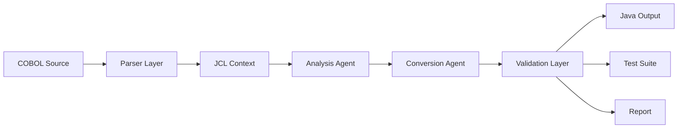

# COBOL Modernization with Generative AI

## Overview

This project proposes a structured and reliable approach to COBOL modernization using Generative AI.

The goal is not only to convert COBOL code to modern languages (e.g., Java), but to ensure:

- functional correctness
- business logic preservation
- reliability of generated systems

> **Correctness is not about syntax — it's about behavior.**

---

## Architecture Overview

```
COBOL Input
    → Parser Layer (ANTLR / ProLeap)
    → Context Extraction (JCL)
    → Analysis Agent (LLM)
    → Conversion Agent (LLM)
    → Validation Layer
    → Output (Java + Test Suite + Report)
```



---

## Key Innovation

Instead of sending raw COBOL directly to an LLM, the system:

1. **Extracts structure** using deterministic parsers (AST, variables, control flow)
2. **Extracts meaning** using LLMs (business rules, intent, complexity)
3. **Performs guided conversion** with both structural and semantic context
4. **Validates behavior** through functional equivalence testing

This hybrid approach dramatically reduces hallucinations and improves consistency.

---

## Key Benefits

| Benefit | Description |
|---------|-------------|
| **Reduced Hallucinations** | Parsers provide ground truth; LLMs receive structured context instead of raw code |
| **Improved Consistency** | Deterministic extraction ensures identical inputs always produce identical structure |
| **Business Logic Preservation** | Semantic analysis identifies and catalogs rules before conversion begins |
| **Enterprise-Ready** | Air-gapped LLM support, audit trails, human-in-the-loop review gates |
| **Measurable Reliability** | Validation layer produces quantifiable equivalence metrics |

---

## Technology Stack

| Component | Technology |
|-----------|-----------|
| COBOL Parser | ANTLR4 / ProLeap COBOL Parser |
| Agent Framework | LangChain / LangGraph |
| LLM Provider | Claude / GPT-4 (abstracted) |
| Target Language | Java (Spring Boot) |
| Frontend Dashboard | Next.js + TypeScript |
| Validation | JUnit + custom comparator |

---

## Documentation

| Document | Description |
|----------|-------------|
| [architecture.md](architecture.md) | System layers, data flow, and component design |
| [parser-layer.md](parser-layer.md) | COBOL parsing, AST generation, structural extraction |
| [jcl-context.md](jcl-context.md) | JCL parsing and execution context extraction |
| [analysis-agent.md](analysis-agent.md) | LLM-powered semantic analysis and business rule extraction |
| [conversion-agent.md](conversion-agent.md) | Guided Java code generation |
| [validation.md](validation.md) | Functional equivalence testing and trust verification |
| [workflow.md](workflow.md) | End-to-end pipeline orchestration |
| [design-decisions.md](design-decisions.md) | Rationale behind key architectural choices |
| [examples/end-to-end-example.md](examples/end-to-end-example.md) | Complete worked example from COBOL to Java |

---

## Quick Start

```bash
# 1. Clone the repository
git clone https://github.com/your-org/cobol-modernization-ai.git
cd cobol-modernization-ai

# 2. Install dependencies
pip install -r requirements.txt

# 3. Configure LLM provider
cp .env.example .env
# Edit .env with your API key and model preferences

# 4. Run the pipeline on a COBOL file
python -m pipeline.run --input samples/TXNPROC.cbl --jcl samples/TXNPROC.jcl

# 5. Launch the dashboard
cd dashboard && npm install && npm run dev
```

---

## Pipeline Stages (CLI)

```bash
# Parse only
python -m pipeline.parse --input TXNPROC.cbl --output ast.json

# Analyze only (requires parser output)
python -m pipeline.analyze --ast ast.json --jcl context.json

# Convert only (requires analysis output)
python -m pipeline.convert --analysis analysis.json --cobol TXNPROC.cbl

# Full pipeline
python -m pipeline.run --input TXNPROC.cbl --jcl TXNPROC.jcl --target java

# Validate
python -m pipeline.validate --cobol-output expected.dat --java-output actual.dat
```

---

## Dashboard UI

The project includes a Next.js dashboard for visual pipeline management:

```
app/
│
├── page.tsx                    # Main dashboard
├── components/
│   ├── UploadPanel.tsx         # COBOL file upload
│   ├── ParserView.tsx          # AST visualization
│   ├── AnalysisView.tsx        # Semantic JSON viewer
│   ├── ConversionView.tsx      # Generated Java display
│   ├── PipelineStepper.tsx     # Step progress indicator
│   └── JsonViewer.tsx          # Formatted JSON display
```

Pipeline flow in the UI:

```
[1] Upload → [2] Parsing → [3] Analysis → [4] Conversion
```

---

## Project Status

| Component | Status |
|-----------|--------|
| Parser Layer | 🔧 In Design |
| JCL Context | 🔧 In Design |
| Analysis Agent | 🔧 In Design |
| Conversion Agent | 🔧 In Design |
| Validation Layer | 🔧 In Design |
| Dashboard UI | 🔧 In Design |

---

## License

Proprietary — All rights reserved.