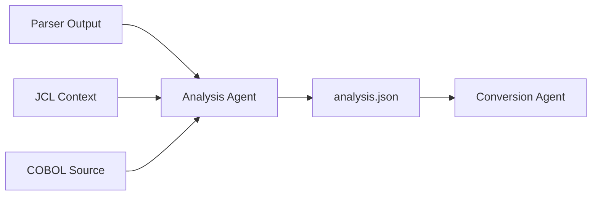
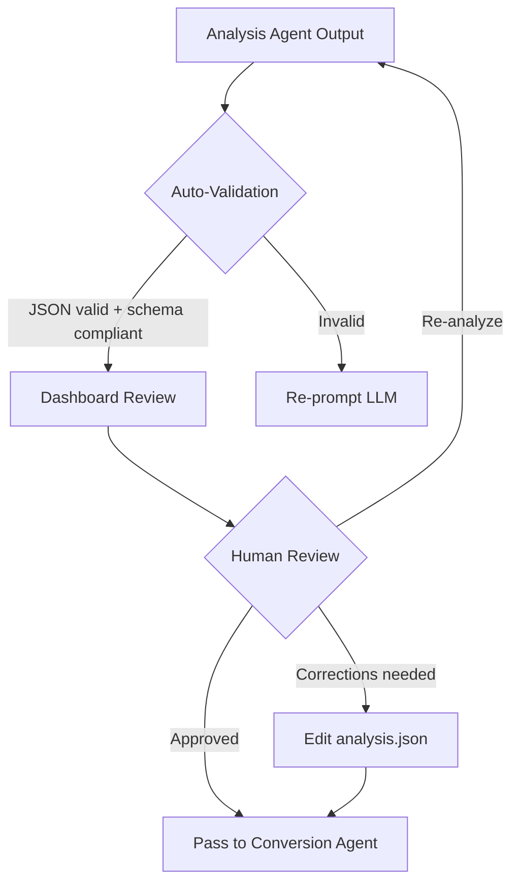

# Analysis Agent

## Role

The Analysis Agent transforms structured parser outputs into **semantic understanding**. It is an LLM-powered component that reads the AST, variable map, control flow graph, and JCL context — and produces a structured JSON report describing the program's purpose, business rules, complexity, and risks.

The key distinction: the **parser** extracts *what the code is*. The **Analysis Agent** extracts *what the code means*.

---

## Position in Pipeline



---

## Inputs

The Analysis Agent receives three inputs:

| Input | Source | Purpose |
|-------|--------|---------|
| **Parser outputs** | Parser Layer | AST, variable map, control flow, dependencies |
| **JCL context** | JCL Parser | Execution context, I/O mapping, batch flow |
| **Raw COBOL source** | User upload | Original code for LLM reference |

The parser outputs are the **primary input** — they provide the structured foundation that prevents the LLM from hallucinating structure. The raw COBOL source is provided as supplementary context for cases where the parser's abstraction loses nuance (e.g., inline comments describing business intent).

---

## Outputs

The Analysis Agent produces a single structured JSON document:

```json
{
  "program_id": "TXNPROC",
  "summary": "Processes daily bank transactions by validating account balances against transaction amounts. Rejects transactions with insufficient funds and updates balances for approved transactions.",
  
  "business_rules": [
    {
      "id": "BR-001",
      "description": "Reject transaction if account balance is less than transaction amount",
      "source_paragraph": "VALIDATE-TXN",
      "source_lines": "45-52",
      "category": "validation",
      "criticality": "high",
      "conditions": ["WS-BALANCE < WS-AMOUNT"],
      "actions": ["MOVE 'REJECTED' TO WS-STATUS"]
    },
    {
      "id": "BR-002",
      "description": "Approve transaction and deduct amount from balance if funds are sufficient",
      "source_paragraph": "VALIDATE-TXN",
      "source_lines": "53-56",
      "category": "calculation",
      "criticality": "high",
      "conditions": ["WS-BALANCE >= WS-AMOUNT"],
      "actions": ["SUBTRACT WS-AMOUNT FROM WS-BALANCE", "MOVE 'APPROVED' TO WS-STATUS"]
    },
    {
      "id": "BR-003",
      "description": "Write rejected transactions to error file for review",
      "source_paragraph": "WRITE-ERROR",
      "source_lines": "70-75",
      "category": "error_handling",
      "criticality": "medium",
      "conditions": ["WS-STATUS = 'REJECTED'"],
      "actions": ["WRITE ERROR-RECORD"]
    }
  ],

  "sections": [
    {
      "name": "MAIN-LOGIC",
      "role": "Entry point — orchestrates read, validate, write cycle",
      "calls": ["READ-INPUT", "VALIDATE-TXN", "WRITE-OUTPUT", "WRITE-ERROR"]
    },
    {
      "name": "READ-INPUT",
      "role": "Reads next transaction record from input file",
      "io": "READ INFILE"
    },
    {
      "name": "VALIDATE-TXN",
      "role": "Core business logic — balance validation and status assignment",
      "business_rules": ["BR-001", "BR-002"]
    },
    {
      "name": "WRITE-OUTPUT",
      "role": "Writes approved transactions to output file",
      "io": "WRITE OUTFILE"
    },
    {
      "name": "WRITE-ERROR",
      "role": "Writes rejected transactions to error file",
      "io": "WRITE ERRFILE",
      "business_rules": ["BR-003"]
    }
  ],

  "complexity": {
    "overall": "medium",
    "score": 35,
    "factors": {
      "lines_of_code": 120,
      "paragraph_count": 5,
      "cyclomatic_complexity": 4,
      "nesting_depth_max": 2,
      "go_to_count": 0,
      "external_calls": 0,
      "file_io_operations": 3,
      "data_items": 12
    }
  },

  "risks": [
    {
      "id": "RISK-001",
      "type": "precision",
      "severity": "high",
      "description": "WS-BALANCE and WS-AMOUNT use COMP-3 packed decimal. Java conversion must use BigDecimal to preserve precision.",
      "affected_variables": ["WS-BALANCE", "WS-AMOUNT"],
      "recommendation": "Map to java.math.BigDecimal, not double/float"
    },
    {
      "id": "RISK-002",
      "type": "implicit_behavior",
      "severity": "medium",
      "description": "COBOL SUBTRACT verb updates WS-BALANCE in-place. Java code must ensure the same variable is modified, not a copy.",
      "affected_variables": ["WS-BALANCE"],
      "recommendation": "Use mutable state or explicit reassignment"
    }
  ],

  "data_flow": {
    "inputs": ["BANK.DAILY.INPUT"],
    "outputs": ["BANK.DAILY.OUTPUT", "BANK.DAILY.ERRORS"],
    "flow_description": "Records are read sequentially from input, validated, then routed to either the output file (approved) or error file (rejected)."
  }
}
```

---

## Responsibilities

### 1. Program Summarization

Generate a concise, human-readable summary of what the program does:

```
Input:  AST + JCL context for TXNPROC
Output: "Processes daily bank transactions by validating account balances..."
```

### 2. Business Rule Extraction

Identify and catalog every business rule with:
- Unique identifier (`BR-001`)
- Natural language description
- Source location (paragraph + line numbers)
- Triggering conditions
- Resulting actions
- Criticality level

### 3. Section Role Analysis

For each paragraph/section, determine its purpose:
- Orchestration (main loop)
- I/O (read/write)
- Validation (business rules)
- Calculation (arithmetic)
- Error handling

### 4. Complexity Assessment

Calculate a complexity score using:

| Factor | Weight | Notes |
|--------|--------|-------|
| Lines of code | Low | Raw size indicator |
| Cyclomatic complexity | High | Branching/loop depth |
| `GO TO` usage | High | Unstructured control flow |
| Nesting depth | Medium | Deeply nested IFs/PERFORMs |
| External dependencies | Medium | CALLs, CICS, DB2 |
| `REDEFINES` usage | Medium | Memory aliasing complexity |

### 5. Risk Identification

Flag known risk patterns:

| Risk | Severity | Why |
|------|----------|-----|
| `COMP-3` / packed decimal | 🔴 High | Java `double` will lose precision |
| `GO TO` statements | 🔴 High | Breaks structured flow |
| `REDEFINES` | 🟡 Medium | Memory aliasing has no Java equivalent |
| `ALTER` verb | 🔴 High | Self-modifying code |
| Deeply nested `PERFORM THRU` | 🟡 Medium | Range ambiguity |
| Implicit file status | 🟡 Medium | Error handling may be missing |

---

## LLM Prompt Engineering

The Analysis Agent uses a structured prompt template:

```
You are a COBOL analysis expert. You receive structured parser outputs and must
produce a semantic analysis in JSON format.

## INPUTS PROVIDED:

### AST (Abstract Syntax Tree)
{ast_json}

### Variable Map
{variable_map_json}

### Control Flow Graph
{control_flow_json}

### JCL Execution Context
{jcl_context_json}

### Raw COBOL Source (for reference only)
{cobol_source}

## YOUR TASK:

Analyze the program and produce a JSON document with these sections:
1. "summary" — one-paragraph description of the program's purpose
2. "business_rules" — array of identified business rules (see schema)
3. "sections" — array of paragraph/section descriptions
4. "complexity" — overall assessment with scoring factors
5. "risks" — array of identified risks for conversion

## RULES:
- Base your analysis on the PARSER OUTPUTS, not the raw source
- If the parser output and raw source disagree, trust the parser
- Every business rule must reference a source paragraph and line range
- Do not invent rules that aren't evidenced in the AST
- Flag any uncertainty in a "notes" field

## OUTPUT FORMAT:
Return valid JSON only. No markdown, no explanation outside the JSON.
```

---

## Human-in-the-Loop Review

Before the Analysis Agent output is passed to the Conversion Agent, it must be reviewed:



Review checklist:
- [ ] Business rules are complete and correct
- [ ] No hallucinated rules (rules not evidenced in the code)
- [ ] Complexity assessment is reasonable
- [ ] Risks are correctly identified
- [ ] Section descriptions match actual paragraph behavior

---

## Key Insight

> The Analysis Agent converts **structure into meaning**. It bridges the gap between deterministic parser output and the semantic understanding needed for intelligent code conversion.