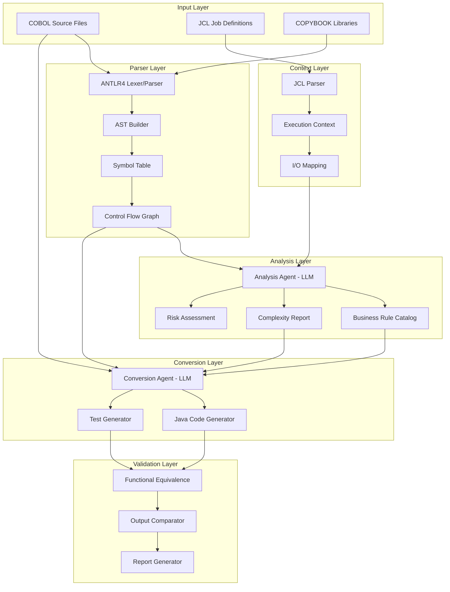
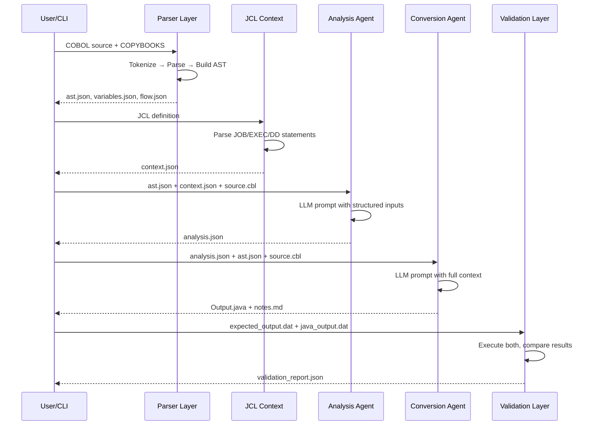
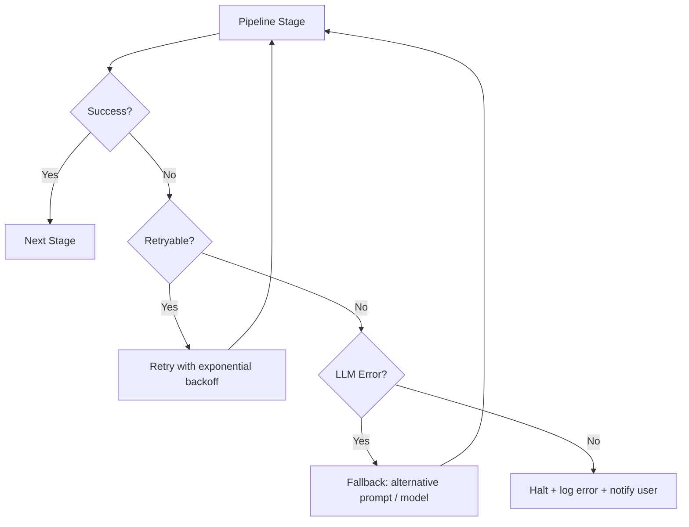

# Architecture

## Overview

The architecture separates concerns into four layers:

1. **Structural extraction** — deterministic, parser-driven
2. **Context extraction** — JCL → execution metadata
3. **Semantic analysis** — LLM-driven understanding
4. **Conversion & validation** — guided generation + equivalence testing

Each layer produces well-defined outputs that feed into the next, creating a pipeline where **deterministic precision meets generative intelligence**.

---

## System Architecture Diagram



---

## Pipeline Flow

```
COBOL → Parser → Analysis → Conversion → Validation
```

Each stage is independently executable and produces serializable output (JSON/code), enabling:

- **Incremental processing** — re-run a single stage without repeating the full pipeline
- **Debugging** — inspect intermediate outputs at any stage
- **Caching** — skip stages whose inputs haven't changed

---

## Design Philosophy

| Principle | Implementation |
|-----------|---------------|
| **Deterministic layers for structure** | Parser uses ANTLR4 grammar — same input always produces same AST |
| **LLM layers for semantics** | Analysis and Conversion agents use structured prompts with parser outputs |
| **Controlled generation** | LLM never sees raw COBOL alone — always receives structured context |
| **Measurable reliability** | Validation layer quantifies functional equivalence with pass/fail metrics |

---

## Layer Responsibilities

| Layer | Input | Output | Type |
|-------|-------|--------|------|
| **Parser Layer** | COBOL source + COPYBOOKS | AST, variable map, control flow, dependencies | Deterministic |
| **JCL Layer** | JCL definitions | Execution context, I/O mapping, batch flow | Deterministic |
| **Analysis Agent** | Parser output + JCL context + COBOL source | Business rules JSON, complexity score, risk flags | LLM-driven |
| **Conversion Agent** | Analysis JSON + parser output + COBOL source | Java source code, mapping notes | LLM-driven |
| **Validation Layer** | Original COBOL output + generated Java output | Equivalence report, test results | Deterministic |

---

## Data Flow Between Layers



---

## Full-Stack Architecture

```
Frontend (Next.js)
        ↓ REST API
API Layer (Node.js / Python FastAPI)
        ↓
┌─────────────────────────────────────┐
│  1. Parser (ANTLR4 / ProLeap)      │  ← Deterministic
│  2. JCL Parser                     │  ← Deterministic
│  3. Analysis Agent (Claude / GPT)  │  ← LLM
│  4. Conversion Agent               │  ← LLM
│  5. Validation Engine              │  ← Deterministic
└─────────────────────────────────────┘
        ↓
Return results to UI (JSON + Java code)
```

---

## Component Inventory

| Component | Technology | Purpose |
|-----------|-----------|---------|
| `parser/cobol_lexer.g4` | ANTLR4 | Tokenize COBOL source |
| `parser/cobol_parser.g4` | ANTLR4 | Grammar rules for AST construction |
| `parser/ast_builder.py` | Python | Walk parse tree, build JSON AST |
| `parser/symbol_table.py` | Python | Track variable definitions and usage |
| `jcl/jcl_parser.py` | Python | Parse JCL JOB/EXEC/DD statements |
| `agents/analysis_agent.py` | LangChain | LLM-driven semantic analysis |
| `agents/conversion_agent.py` | LangChain | LLM-driven code generation |
| `validation/comparator.py` | Python | Output comparison engine |
| `validation/test_generator.py` | Python | Auto-generate JUnit tests |
| `pipeline/orchestrator.py` | LangGraph | State machine pipeline controller |
| `dashboard/` | Next.js | Web UI for upload, visualization, pipeline control |

---

## Error Handling Strategy



---

## Key Insight

> The parser extracts structure, and the LLM extracts meaning. Neither alone is sufficient — together they produce reliable modernization.