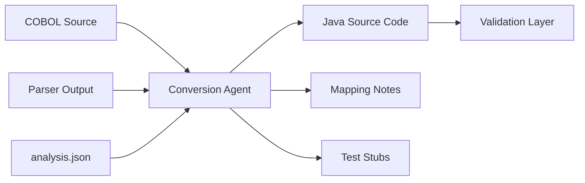

# Conversion Agent

## Role

The Conversion Agent generates idiomatic Java code from enriched inputs. It receives the COBOL source, parser outputs, and semantic analysis JSON — and produces working, well-structured Java code that **preserves behavior** while following modern conventions.

The Conversion Agent is the most critical LLM-driven component. Its output is what the enterprise actually deploys. Every design decision in the pipeline exists to make this agent more reliable.

---

## Position in Pipeline



---

## Inputs

| Input | Source | Purpose |
|-------|--------|---------|
| **Raw COBOL source** | User upload | Original code for reference and inline comments |
| **Parser output** | Parser Layer | AST, variable map, control flow, dependencies — structural ground truth |
| **analysis.json** | Analysis Agent | Business rules, section roles, complexity, risks — semantic context |
| **Configuration** | User/CLI | Target language, framework, naming conventions, package structure |

---

## Why This Works

### Without structured context (naive approach):

```
Prompt: "Convert this COBOL to Java"
+ 2000 lines of raw COBOL

Result: LLM guesses at structure, hallucinates variables,
        misses COMP-3 precision, produces "JOBOL"
```

### With structured context (our approach):

```
Prompt: "Convert this COBOL to Java"
+ AST JSON (exact structure)
+ Variable map (types, sizes, usage)
+ Business rules (what the code means)
+ Risk flags (COMP-3 → BigDecimal)

Result: LLM reasons over structure, respects types,
        preserves business logic, produces idiomatic Java
```

---

## Conversion Strategy: Two Layers

### Layer 1: Deterministic Mapping (Rule-Based)

Mechanical syntax transformations that don't require AI:

| COBOL Construct | Java Equivalent | Rule |
|----------------|----------------|------|
| `MOVE A TO B` | `b = a;` | Direct assignment |
| `ADD A TO B` | `b = b.add(a);` | BigDecimal addition |
| `SUBTRACT A FROM B` | `b = b.subtract(a);` | BigDecimal subtraction |
| `MULTIPLY A BY B` | `b = b.multiply(a);` | BigDecimal multiplication |
| `DIVIDE A INTO B` | `b = b.divide(a, scale, RoundingMode.HALF_UP);` | BigDecimal division with scale |
| `IF cond ... END-IF` | `if (cond) { ... }` | Conditional block |
| `EVALUATE ... WHEN` | `switch / if-else chain` | Multi-branch logic |
| `PERFORM para` | `para();` | Method call |
| `PERFORM para UNTIL cond` | `while (!cond) { para(); }` | Loop |
| `PERFORM para VARYING i` | `for (int i = ...) { para(); }` | Counted loop |
| `STRING ... DELIMITED BY` | `StringBuilder.append()` | String concatenation |
| `UNSTRING ... DELIMITED BY` | `String.split()` | String splitting |
| `DISPLAY` | `System.out.println()` | Console output |
| `ACCEPT` | `Scanner.nextLine()` | Console input |
| `STOP RUN` | `System.exit(0);` | Program termination |

### Layer 2: LLM-Driven Refactoring (AI)

Intelligent transformations that require semantic understanding:

- **Class decomposition** — decide which paragraphs become methods vs. which become separate classes
- **Design pattern application** — e.g., Strategy pattern for branching business rules
- **Naming conventions** — convert `WS-CUSTOMER-BALANCE` to `customerBalance`
- **Error handling** — convert implicit COBOL error handling to Java exceptions
- **Collection usage** — convert `OCCURS` tables to `List<>` or arrays
- **Modern I/O** — convert file READ/WRITE to `BufferedReader`/`BufferedWriter` or Spring Batch readers

---

## Handling COBOL-Specific Constructs

### COMP-3 (Packed Decimal) → BigDecimal

**This is the #1 source of conversion bugs.**

```cobol
       05 WS-BALANCE    PIC 9(10)V99 COMP-3.
       05 WS-AMOUNT     PIC 9(10)V99 COMP-3.
```

❌ **Wrong** (precision loss):
```java
double balance = 0.0;
double amount = 0.0;
balance -= amount;  // floating-point rounding errors
```

✅ **Correct**:
```java
BigDecimal balance = BigDecimal.ZERO.setScale(2, RoundingMode.HALF_UP);
BigDecimal amount = BigDecimal.ZERO.setScale(2, RoundingMode.HALF_UP);
balance = balance.subtract(amount);
```

### REDEFINES → Union-like Access

```cobol
       01 WS-DATE.
          05 WS-DATE-NUM     PIC 9(8).
       01 WS-DATE-PARTS REDEFINES WS-DATE.
          05 WS-YEAR          PIC 9(4).
          05 WS-MONTH         PIC 9(2).
          05 WS-DAY           PIC 9(2).
```

Java approach — dedicated class with accessor methods:

```java
public class DateField {
    private String rawValue; // "20260420"

    public int getDateNum() { return Integer.parseInt(rawValue); }
    public int getYear()    { return Integer.parseInt(rawValue.substring(0, 4)); }
    public int getMonth()   { return Integer.parseInt(rawValue.substring(4, 6)); }
    public int getDay()     { return Integer.parseInt(rawValue.substring(6, 8)); }
}
```

### OCCURS DEPENDING ON → Dynamic List

```cobol
       01 WS-TABLE.
          05 WS-COUNT         PIC 99.
          05 WS-ITEMS OCCURS 1 TO 50 DEPENDING ON WS-COUNT.
             10 WS-ITEM-NAME  PIC X(20).
             10 WS-ITEM-AMT   PIC 9(7)V99.
```

```java
public class WorkingStorage {
    private int itemCount;
    private List<Item> items = new ArrayList<>();

    public static class Item {
        private String name;        // WS-ITEM-NAME
        private BigDecimal amount;  // WS-ITEM-AMT
    }
}
```

### 88-Level Conditions → Enum or Constants

```cobol
       05 WS-STATUS          PIC X(10).
          88 STATUS-APPROVED  VALUE 'APPROVED'.
          88 STATUS-REJECTED  VALUE 'REJECTED'.
          88 STATUS-PENDING   VALUE 'PENDING'.
```

```java
public enum TransactionStatus {
    APPROVED("APPROVED"),
    REJECTED("REJECTED"),
    PENDING("PENDING");

    private final String cobolValue;

    TransactionStatus(String cobolValue) {
        this.cobolValue = cobolValue;
    }
}
```

### GO TO → Structured Control Flow

`GO TO` breaks structured programming. The Conversion Agent must refactor:

```cobol
           IF WS-ERROR
               GO TO ERROR-EXIT
           END-IF.
           PERFORM PROCESS-RECORD.
       ERROR-EXIT.
           DISPLAY 'ERROR OCCURRED'.
           STOP RUN.
```

```java
// Refactored: GO TO eliminated, replaced with early return + exception
public void mainLogic() {
    if (hasError) {
        handleErrorExit();
        return;
    }
    processRecord();
}

private void handleErrorExit() {
    System.out.println("ERROR OCCURRED");
    System.exit(1);
}
```

---

## Avoiding "JOBOL"

"JOBOL" is Java code that looks like COBOL — procedural, monolithic, with meaningless names. The Conversion Agent actively avoids this:

| JOBOL (Bad) | Idiomatic Java (Good) |
|-------------|----------------------|
| `static int WS_BALANCE;` | `private BigDecimal balance;` |
| One giant `main()` method | Domain classes with focused methods |
| All state in global variables | Encapsulated in objects |
| `if/else` chains 10 levels deep | Strategy pattern or polymorphism |
| `System.out.println` for errors | `throw new InsufficientFundsException()` |
| Raw file I/O in business logic | Repository/DAO pattern |

---

## LLM Prompt Template

```
You are a COBOL-to-Java conversion expert. You receive structured inputs
and must generate idiomatic, production-ready Java code.

## INPUTS:

### Parser Output (AST)
{ast_json}

### Variable Map
{variable_map_json}

### Semantic Analysis
{analysis_json}

### Raw COBOL Source (reference)
{cobol_source}

### Configuration
- Target: Java 17+ with Spring Boot
- Package: com.bank.modernized.{program_name}
- Naming: camelCase for variables, PascalCase for classes

## CONVERSION RULES:
1. ALL numeric fields with COMP-3 or implied decimal (V) MUST use BigDecimal
2. COBOL paragraph names → Java method names (camelCase)
3. Working-Storage variables → class fields
4. PERFORM → method call
5. EVALUATE → switch/case or if-else chain
6. File I/O → BufferedReader/Writer or Spring Batch equivalents
7. 88-level conditions → enum or constants
8. REDEFINES → accessor class
9. GO TO → refactor to structured control flow (early return, exceptions)
10. Preserve ALL business logic — do not simplify, optimize, or skip any condition

## ANTI-PATTERNS TO AVOID:
- Do NOT use float/double for monetary values
- Do NOT create one monolithic class
- Do NOT keep COBOL-style naming (WS-, WS_)
- Do NOT use global mutable state

## OUTPUT FORMAT:
Return Java source code only. Include:
1. Package declaration
2. Import statements
3. Class definition with methods
4. Inline comments referencing original COBOL paragraph names

After the code, include a "## MAPPING NOTES" section documenting:
- Each COBOL paragraph → Java method mapping
- Any assumptions made
- Any uncertainties or areas requiring human review
```

---

## Example Output

### Input: COBOL Transaction Processor

### Generated Java:

```java
package com.bank.modernized.txnproc;

import java.math.BigDecimal;
import java.math.RoundingMode;
import java.io.*;

/**
 * Transaction Processor
 * Converted from: TXNPROC.cbl
 * Original paragraphs: MAIN-LOGIC, READ-INPUT, VALIDATE-TXN,
 *                       WRITE-OUTPUT, WRITE-ERROR
 */
public class TransactionProcessor {

    // Working-Storage equivalents
    private BigDecimal balance = BigDecimal.ZERO.setScale(2, RoundingMode.HALF_UP);
    private BigDecimal amount = BigDecimal.ZERO.setScale(2, RoundingMode.HALF_UP);
    private TransactionStatus status = TransactionStatus.PENDING;

    /**
     * MAIN-LOGIC paragraph
     * Entry point — orchestrates the transaction processing cycle
     */
    public void execute(String inputPath, String outputPath, String errorPath) {
        try (BufferedReader reader = new BufferedReader(new FileReader(inputPath));
             BufferedWriter writer = new BufferedWriter(new FileWriter(outputPath));
             BufferedWriter errorWriter = new BufferedWriter(new FileWriter(errorPath))) {

            String record;
            while ((record = readInput(reader)) != null) {
                parseRecord(record);
                validateTransaction();  // PERFORM VALIDATE-TXN

                if (status == TransactionStatus.APPROVED) {
                    writeOutput(writer);   // PERFORM WRITE-OUTPUT
                } else {
                    writeError(errorWriter); // PERFORM WRITE-ERROR
                }
            }
        } catch (IOException e) {
            throw new RuntimeException("Transaction processing failed", e);
        }
    }

    /**
     * READ-INPUT paragraph
     */
    private String readInput(BufferedReader reader) throws IOException {
        return reader.readLine();
    }

    /**
     * VALIDATE-TXN paragraph
     * Business Rule BR-001: Reject if balance < amount
     * Business Rule BR-002: Approve and deduct if balance >= amount
     */
    private void validateTransaction() {
        if (balance.compareTo(amount) < 0) {
            // BR-001: Insufficient funds
            status = TransactionStatus.REJECTED;
        } else {
            // BR-002: Sufficient funds — deduct and approve
            balance = balance.subtract(amount);
            status = TransactionStatus.APPROVED;
        }
    }

    /**
     * WRITE-OUTPUT paragraph
     */
    private void writeOutput(BufferedWriter writer) throws IOException {
        writer.write(formatOutputRecord());
        writer.newLine();
    }

    /**
     * WRITE-ERROR paragraph
     * Business Rule BR-003: Log rejected transactions
     */
    private void writeError(BufferedWriter errorWriter) throws IOException {
        errorWriter.write(formatErrorRecord());
        errorWriter.newLine();
    }
}
```

---

## Configuration Options

| Option | Values | Default | Description |
|--------|--------|---------|-------------|
| `target_language` | `java`, `python` | `java` | Target language for code generation |
| `java_version` | `11`, `17`, `21` | `17` | Java version features to use |
| `framework` | `none`, `spring-boot`, `spring-batch` | `spring-boot` | Framework for generated code |
| `package_name` | string | `com.modernized` | Base package for generated classes |
| `naming_style` | `camelCase`, `snake_case` | `camelCase` | Variable naming convention |
| `decimal_strategy` | `bigdecimal`, `long-cents` | `bigdecimal` | How to handle decimal arithmetic |
| `io_strategy` | `buffered`, `spring-batch`, `jdbc` | `buffered` | I/O implementation strategy |
| `generate_tests` | `true`, `false` | `true` | Auto-generate JUnit test stubs |

---

## Key Insight

> Guided generation improves reliability. The Conversion Agent never operates in a vacuum — it always has structural truth (parser), semantic context (analysis), and explicit rules (configuration) to constrain its output. This is what makes it enterprise-grade rather than experimental.