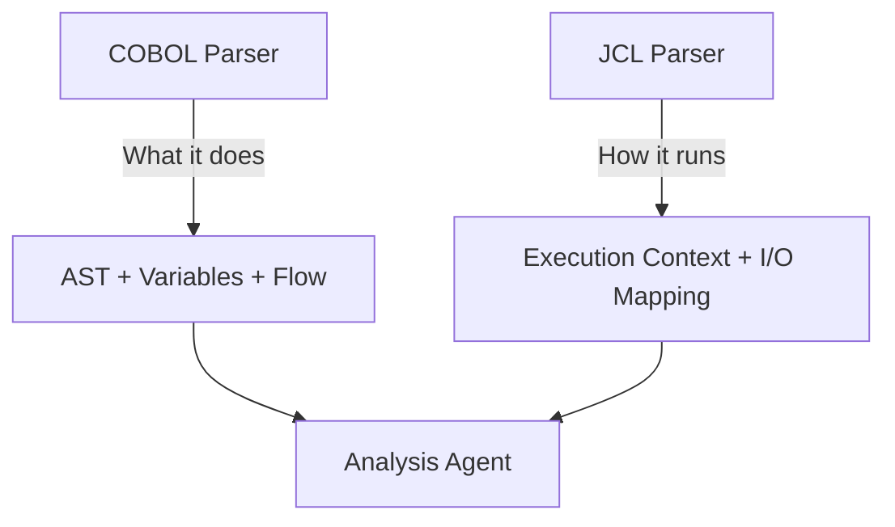
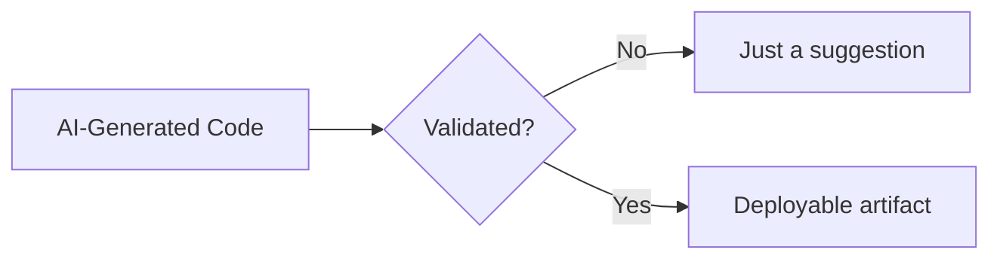

# Design Decisions

This document explains the **why** behind every major architectural choice. Each decision is presented as a question, followed by the rationale and trade-offs considered.

---

## Decision 1: Why Parser Before Analysis?

### The Problem

Sending raw COBOL to an LLM for analysis is unreliable:

- LLMs may misinterpret column-based formatting
- COPYBOOK references are unresolved
- Control flow via `PERFORM` ranges is ambiguous without static analysis
- Variable types depend on `PICTURE` clause parsing, which LLMs often get wrong

### The Decision

**Parse COBOL deterministically first, then send structured outputs to the LLM.**

### Rationale

| Approach | Accuracy | Cost | Speed | Consistency |
|----------|----------|------|-------|-------------|
| Raw COBOL → LLM | Low-Medium | High (long prompts) | Slow | Low (non-deterministic) |
| Parser → LLM | High | Lower (structured prompts) | Fast | High (deterministic base) |

The parser provides:
- **Structured input** — JSON AST instead of raw text
- **Reduced ambiguity** — variable types, control flow, and dependencies are pre-resolved
- **Improved LLM reasoning** — the LLM focuses on semantics, not syntax
- **Smaller prompts** — structured JSON is more token-efficient than raw COBOL

### Trade-off

Requires maintaining a COBOL grammar (ANTLR4), which must handle dialect variations (IBM, MicroFocus, GnuCOBOL). This is a one-time investment that pays off across every conversion.

---

## Decision 2: Why Separate JCL from COBOL Parsing?

### The Problem

JCL and COBOL serve fundamentally different purposes:
- COBOL defines **what** the program does (logic)
- JCL defines **how** the program runs (orchestration)

Mixing them in a single parser would conflate two distinct concerns.

### The Decision

**Treat JCL as a separate context layer with its own parser.**

### Rationale



- JCL is not code logic — it's infrastructure configuration
- A program might have multiple JCL jobs that invoke it differently
- JCL provides I/O context (dataset names) that COBOL doesn't contain
- Separating them allows independent processing and caching

### Trade-off

Requires a second parser and an additional pipeline stage. However, JCL parsing is simpler than COBOL parsing and adds minimal complexity.

---

## Decision 3: Why Use LLM for Analysis (Not Rules)?

### The Problem

Business rules in COBOL are implicit. They're embedded in conditional logic, arithmetic operations, and data movements. A rule-based extractor would need to encode every possible pattern — an impossible task for diverse enterprise codebases.

### The Decision

**Use an LLM for semantic analysis, constrained by parser outputs.**

### Rationale

| Task | Rule-Based | LLM-Based |
|------|-----------|-----------|
| "What does this IF do?" | Can extract the condition, not the meaning | Can explain: "rejects insufficient funds" |
| "What is this paragraph for?" | Can list its statements | Can summarize: "orchestrates read-validate-write cycle" |
| "Is this a business rule?" | Requires pre-defined patterns | Can reason about intent |
| "How complex is this?" | Can count metrics | Can assess holistic complexity |

The LLM excels at tasks that require **understanding intent** rather than **parsing structure**. By providing the parser's structured output as context, we give the LLM a reliable foundation to reason from.

### Trade-off

LLM outputs are non-deterministic. Mitigations:
- JSON schema validation on every response
- Human review gate before proceeding
- Re-prompt with stricter constraints if output is invalid
- Temperature set to 0 for maximum determinism

---

## Decision 4: Why a Separate Validation Layer?

### The Problem

LLM-generated code cannot be trusted without verification. Even with structured inputs, LLMs can:
- Introduce subtle bugs (off-by-one, incorrect comparison operators)
- Hallucinate logic that doesn't exist in the original
- Miss edge cases in complex conditional chains
- Use wrong data types (float instead of BigDecimal)

### The Decision

**Dedicated validation layer with 5-level verification and human sign-off.**

### Rationale



- Ensures correctness before deployment
- Builds trust with enterprise stakeholders
- Catches the specific bugs that LLMs tend to introduce
- Provides quantifiable metrics (% match, test pass rate)
- Required in regulated industries (banking, insurance, healthcare)

### Trade-off

Validation requires test data and reference outputs from the COBOL environment. If these aren't available, validation is limited to static analysis and unit tests.

---

## Decision 5: Why Hybrid (Deterministic + AI), Not Pure AI?

### The Problem

Pure AI approaches (sending raw COBOL to an LLM and asking for Java) fail because:
- COBOL programs can be 10,000+ lines — exceeding context windows
- LLMs hallucinate structure when dealing with unfamiliar column-based formatting
- Financial calculations require absolute precision — LLMs are probabilistic
- Enterprise customers require reproducibility — LLMs are non-deterministic

Pure deterministic approaches (transpilers) fail because:
- They produce "JOBOL" — mechanically translated code that's unmaintainable
- They can't understand business intent
- They can't suggest architectural improvements (microservices, design patterns)

### The Decision

**Use deterministic tools for structure, AI for semantics, and deterministic tools for validation.**

```
Deterministic → AI → Deterministic
  (Parser)    (LLM)  (Validator)
```

### Rationale

| Concern | Approach | Why |
|---------|----------|-----|
| Structure (AST, types, flow) | Deterministic parser | Must be 100% accurate |
| Meaning (business rules, intent) | LLM | Requires understanding, not parsing |
| Code generation | LLM (constrained) | Needs creativity + domain knowledge |
| Verification | Deterministic comparison | Must be 100% reliable |

### The Key Insight

> The parser extracts what is **provably true** about the code.
> The LLM extracts what is **probably meant** by the code.
> The validator confirms what is **actually equivalent** in the output.

---

## Decision 6: Why AST-First, Not Raw Source Prompting?

### The Problem

Sending raw COBOL source to an LLM wastes tokens on formatting noise and risks structural misinterpretation.

### The Decision

**Always provide the AST as the primary input to LLM agents. Raw source is supplementary context only.**

### Comparison

| Attribute | Raw Source | AST JSON |
|-----------|-----------|----------|
| Token count for 500-line program | ~4,000 tokens | ~2,000 tokens |
| Structural accuracy | LLM must infer | Pre-computed, verified |
| Variable types | Must parse PIC clauses | Already extracted |
| Control flow | Must trace PERFORM/GO TO | Already mapped |
| Ambiguity | High | Low |

### Trade-off

Some contextual information is lost in AST abstraction (inline comments, formatting conventions). Raw source is provided alongside AST for reference when needed.

---

## Decision 7: Why Air-Gapped LLM Support?

### The Problem

Enterprise COBOL codebases contain proprietary business logic that cannot be sent to public API endpoints. Banking, insurance, and government clients require on-premise processing.

### The Decision

**Abstract the LLM provider behind an interface that supports both cloud and on-premise models.**

```python
class LLMProvider(Protocol):
    def analyze(self, prompt: str) -> str: ...
    def convert(self, prompt: str) -> str: ...

class CloudProvider(LLMProvider):     # Claude API, GPT-4 API
    ...

class LocalProvider(LLMProvider):     # Ollama, vLLM, on-prem
    ...
```

### Rationale

- No proprietary source code leaves the client's environment
- Compliant with data sovereignty regulations (GDPR, SOC2, HIPAA)
- Supports air-gapped environments with no internet access
- Model swapping without pipeline changes

---

## Decision 8: Why Human-in-the-Loop Gates?

### The Problem

Fully automated COBOL conversion is too risky for production systems. A single misinterpreted business rule in a banking system could cause financial losses.

### The Decision

**Three mandatory human review gates: after Analysis, after Conversion, and after Validation.**

```
Parse (auto) → Analyze → [HUMAN REVIEW] → Convert → [HUMAN REVIEW] → Validate → [HUMAN SIGN-OFF]
```

### Rationale

- Business rules must be verified by domain experts
- Generated code must be reviewed by Java developers
- Validation results must be signed off by QA
- Provides audit trail for regulatory compliance
- Reduces risk from LLM hallucinations to near-zero

### Trade-off

Slower pipeline execution (human review takes time). Mitigated by:
- Clear, structured review artifacts (analysis.json, not raw text)
- Dashboard UI for efficient review
- Batch approval for low-complexity programs

---

## Decision Summary

| # | Decision | Summary |
|---|----------|---------|
| 1 | Parser before Analysis | Structure must be deterministic, not inferred |
| 2 | Separate JCL | Execution context ≠ code logic |
| 3 | LLM for Analysis | Meaning requires understanding, not pattern matching |
| 4 | Validation Layer | Trust requires verification, not assumption |
| 5 | Hybrid approach | Deterministic precision + generative intelligence |
| 6 | AST-first prompting | Structured input > raw text for LLM reasoning |
| 7 | Air-gapped support | Enterprise security is non-negotiable |
| 8 | Human-in-the-loop | Critical systems require human oversight |

---

## Core Principle

> Do not rely on LLM alone for understanding COBOL. Use deterministic tools for what they do best (structure), AI for what it does best (meaning), and human judgment for what neither can guarantee (correctness in context).