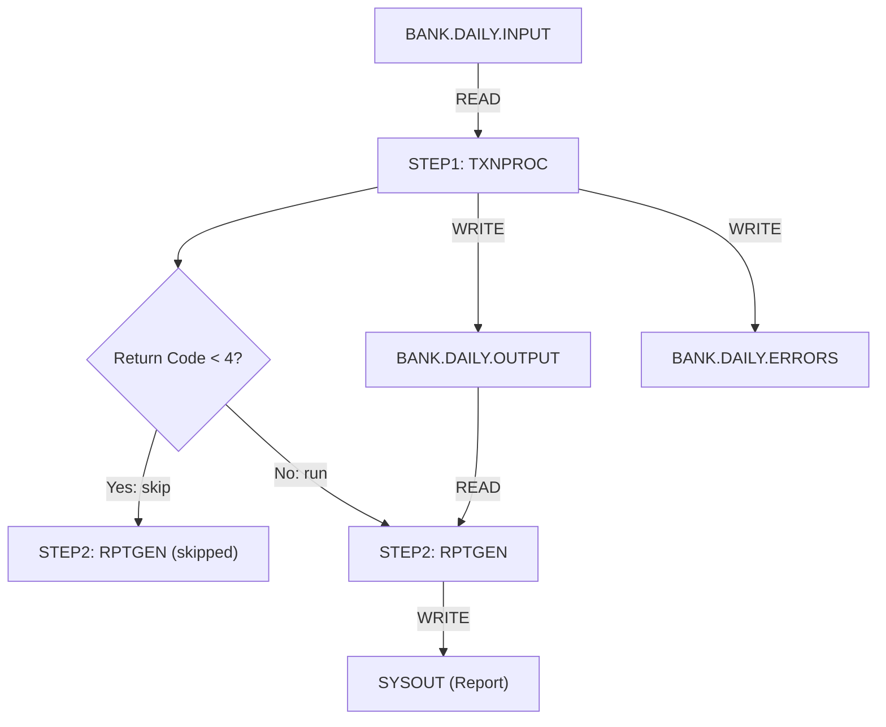

# JCL & Context Extraction

## What is JCL?

JCL (Job Control Language) defines **how** COBOL programs are executed on the mainframe. It specifies:

- Which programs to run and in what order
- Where input data comes from (datasets)
- Where output data goes
- Resource allocation (memory, time limits)
- Conditional execution logic

JCL is the **orchestration layer** of mainframe batch processing — it is to COBOL what a CI/CD pipeline is to modern applications.

---

## Role in Modernization

JCL provides critical execution context that the COBOL source code alone cannot reveal:

| Context Type | What JCL Reveals | Why It Matters |
|-------------|-----------------|----------------|
| **Program identity** | Which program is executed (`PGM=`) | Links JCL steps to COBOL source files |
| **Data sources** | Input dataset names (`DSN=`) | Maps file I/O to actual data sources |
| **Data targets** | Output dataset names | Identifies where results are written |
| **Execution order** | Multi-step jobs | Reveals batch workflow dependencies |
| **Conditional flow** | `COND` parameters | Controls step execution based on return codes |
| **PROC references** | Cataloged procedures | Reusable job templates to expand |

---

## JCL Statement Types

### JOB Statement
Identifies the job and sets job-level parameters:

```jcl
//BANKJOB  JOB (ACCT),'BANK BATCH',
//             CLASS=A,MSGCLASS=X,
//             NOTIFY=&SYSUID
```

### EXEC Statement
Executes a program or procedure:

```jcl
//STEP1    EXEC PGM=TXNPROC,REGION=4M
//STEP2    EXEC PGM=RPTGEN,COND=(4,LT)
```

### DD Statement
Defines data sources and destinations:

```jcl
//INFILE   DD DSN=BANK.DAILY.TRANSACTIONS,DISP=SHR
//OUTFILE  DD DSN=BANK.DAILY.RESULTS,
//            DISP=(NEW,CATLG,DELETE),
//            SPACE=(CYL,(10,5)),
//            DCB=(RECFM=FB,LRECL=80,BLKSIZE=8000)
```

---

## Complete JCL Example

```jcl
//BANKJOB  JOB (ACCT),'DAILY BANK BATCH',CLASS=A,NOTIFY=&SYSUID
//*
//* STEP 1: Process transactions
//*
//STEP1    EXEC PGM=TXNPROC
//INFILE   DD DSN=BANK.DAILY.INPUT,DISP=SHR
//OUTFILE  DD DSN=BANK.DAILY.OUTPUT,DISP=(NEW,CATLG,DELETE),
//            SPACE=(CYL,(10,5)),DCB=(RECFM=FB,LRECL=120)
//ERRFILE  DD DSN=BANK.DAILY.ERRORS,DISP=(NEW,CATLG,DELETE),
//            SPACE=(CYL,(1,1)),DCB=(RECFM=FB,LRECL=120)
//SYSOUT   DD SYSOUT=*
//*
//* STEP 2: Generate report (only if STEP1 succeeded)
//*
//STEP2    EXEC PGM=RPTGEN,COND=(4,LT,STEP1)
//INFILE   DD DSN=BANK.DAILY.OUTPUT,DISP=SHR
//REPORT   DD SYSOUT=*,DCB=(RECFM=FBA,LRECL=133)
```

---

## JCL Parser Output

The JCL parser extracts a structured JSON representation:

```json
{
  "job": {
    "name": "BANKJOB",
    "description": "DAILY BANK BATCH",
    "class": "A",
    "notify": "&SYSUID"
  },
  "steps": [
    {
      "name": "STEP1",
      "program": "TXNPROC",
      "condition": null,
      "dd_statements": [
        {
          "name": "INFILE",
          "dataset": "BANK.DAILY.INPUT",
          "disposition": "SHR",
          "access": "READ",
          "record_format": null,
          "record_length": null
        },
        {
          "name": "OUTFILE",
          "dataset": "BANK.DAILY.OUTPUT",
          "disposition": "NEW,CATLG,DELETE",
          "access": "WRITE",
          "record_format": "FB",
          "record_length": 120
        },
        {
          "name": "ERRFILE",
          "dataset": "BANK.DAILY.ERRORS",
          "disposition": "NEW,CATLG,DELETE",
          "access": "WRITE",
          "record_format": "FB",
          "record_length": 120
        }
      ]
    },
    {
      "name": "STEP2",
      "program": "RPTGEN",
      "condition": {
        "code": 4,
        "operator": "LT",
        "step_ref": "STEP1",
        "meaning": "Skip STEP2 if STEP1 return code < 4"
      },
      "dd_statements": [
        {
          "name": "INFILE",
          "dataset": "BANK.DAILY.OUTPUT",
          "disposition": "SHR",
          "access": "READ"
        },
        {
          "name": "REPORT",
          "dataset": "SYSOUT",
          "access": "WRITE",
          "is_sysout": true
        }
      ]
    }
  ]
}
```

---

## Execution Graph

The parser also builds a dependency graph between job steps:



---

## DD-to-COBOL File Mapping

The JCL context links DD names to COBOL `SELECT` / `FD` statements:

| JCL DD Name | COBOL SELECT | COBOL FD | Dataset |
|-------------|-------------|----------|---------|
| `INFILE` | `SELECT INPUT-FILE ASSIGN TO INFILE` | `FD INPUT-FILE` | `BANK.DAILY.INPUT` |
| `OUTFILE` | `SELECT OUTPUT-FILE ASSIGN TO OUTFILE` | `FD OUTPUT-FILE` | `BANK.DAILY.OUTPUT` |
| `ERRFILE` | `SELECT ERROR-FILE ASSIGN TO ERRFILE` | `FD ERROR-FILE` | `BANK.DAILY.ERRORS` |

This mapping is critical for the Conversion Agent to generate correct I/O code in Java:

```java
// COBOL: READ INFILE INTO WS-RECORD
// JCL:   //INFILE DD DSN=BANK.DAILY.INPUT
// Java equivalent:
BufferedReader reader = new BufferedReader(
    new FileReader("bank/daily/input.dat")  // mapped from DSN
);
```

---

## PROC Expansion

Cataloged procedures (PROCs) are reusable JCL templates:

```jcl
//STEP1    EXEC PROC=BANKPROC,REGION=8M
```

The JCL parser must:

1. Locate the PROC in the procedure library
2. Expand it inline with parameter substitution
3. Track the origin for traceability

---

## Mapping JCL to Modern Equivalents

| JCL Concept | Modern Equivalent | Notes |
|-------------|------------------|-------|
| JOB | Pipeline / workflow | Airflow DAG, Spring Batch Job |
| STEP | Task / stage | Individual processing unit |
| DD (input) | File path / DB connection | Config-driven data source |
| DD (output) | File path / message queue | Config-driven data target |
| COND parameter | Conditional task execution | Airflow branching, exit code checks |
| PROC | Reusable template | Shared library / common config |
| SORT utility | SQL ORDER BY / in-memory sort | Framework-level sorting |

---

## Key Insight

> JCL explains **how** the program runs, not **what** it does. It provides the execution context that makes COBOL code understandable as part of a larger batch workflow rather than an isolated program.