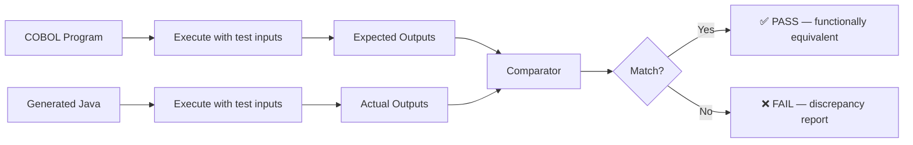
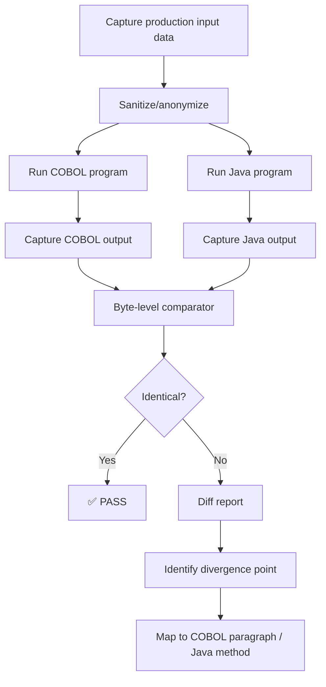
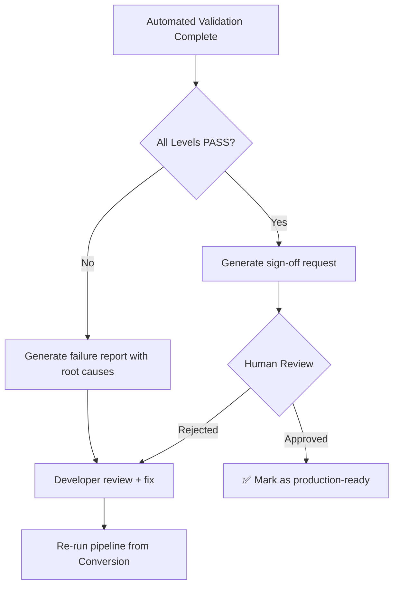

# Validation Layer

## Objective

Ensure **functional equivalence** between the original COBOL program and the generated Java code. The validation layer answers one question:

> Does the Java code produce the same outputs as the COBOL code, given the same inputs?

Validation is not about code similarity — it's about **behavioral equivalence**. The Java code can look completely different from the COBOL code, as long as it behaves identically.

---

## Position in Pipeline



---

## Validation Strategy

The validation layer uses a multi-level approach:

| Level | What It Checks | How |
|-------|---------------|-----|
| **L1: Static Analysis** | Does the Java code compile? Are types correct? | `javac` + linting |
| **L2: Structural Verification** | Does the Java code cover all COBOL paragraphs? | AST comparison |
| **L3: Unit Equivalence** | Do individual methods match COBOL paragraph behavior? | Auto-generated JUnit tests |
| **L4: Integration Equivalence** | Does the full program produce identical output? | Side-by-side execution |
| **L5: Edge Case Testing** | Does behavior match for boundary conditions? | Generated edge case suite |

---

## Level 1: Static Analysis

Before running any tests, verify the code is syntactically and semantically valid:

```bash
# Compile check
javac -Xlint:all TransactionProcessor.java

# Static analysis
checkstyle -c /config/checkstyle.xml TransactionProcessor.java

# SpotBugs for common defects
spotbugs TransactionProcessor.class
```

Automated checks:
- [ ] Code compiles without errors
- [ ] No `float`/`double` used for financial fields (BigDecimal required)
- [ ] No unused variables
- [ ] All methods have non-trivial implementations
- [ ] All business rule comments reference valid BR-IDs from analysis.json

---

## Level 2: Structural Verification

Compare the Java output against the parser's AST to ensure coverage:

```json
{
  "coverage_report": {
    "cobol_paragraphs": 5,
    "java_methods_mapped": 5,
    "unmapped_paragraphs": [],
    "coverage_percentage": 100,
    "mapping": {
      "MAIN-LOGIC": "execute()",
      "READ-INPUT": "readInput()",
      "VALIDATE-TXN": "validateTransaction()",
      "WRITE-OUTPUT": "writeOutput()",
      "WRITE-ERROR": "writeError()"
    }
  }
}
```

Every COBOL paragraph must have a corresponding Java method. Unmapped paragraphs indicate missing logic.

---

## Level 3: Unit Equivalence

Auto-generate JUnit tests from the parser's control flow graph. Each test exercises a single business rule:

```java
import org.junit.jupiter.api.Test;
import java.math.BigDecimal;
import static org.junit.jupiter.api.Assertions.*;

/**
 * Auto-generated equivalence tests for TXNPROC
 * Source: analysis.json business rules
 */
class TransactionProcessorTest {

    /**
     * BR-001: Reject transaction if balance < amount
     * COBOL: IF WS-BALANCE < WS-AMOUNT → MOVE 'REJECTED' TO WS-STATUS
     */
    @Test
    void testBR001_rejectInsufficientFunds() {
        TransactionProcessor processor = new TransactionProcessor();
        processor.setBalance(new BigDecimal("100.00"));
        processor.setAmount(new BigDecimal("150.00"));

        processor.validateTransaction();

        assertEquals(TransactionStatus.REJECTED, processor.getStatus());
        assertEquals(new BigDecimal("100.00"), processor.getBalance(),
            "Balance must not change on rejection");
    }

    /**
     * BR-002: Approve and deduct if balance >= amount
     * COBOL: SUBTRACT WS-AMOUNT FROM WS-BALANCE, MOVE 'APPROVED'
     */
    @Test
    void testBR002_approveAndDeduct() {
        TransactionProcessor processor = new TransactionProcessor();
        processor.setBalance(new BigDecimal("500.00"));
        processor.setAmount(new BigDecimal("150.00"));

        processor.validateTransaction();

        assertEquals(TransactionStatus.APPROVED, processor.getStatus());
        assertEquals(new BigDecimal("350.00"), processor.getBalance(),
            "Balance must be reduced by amount");
    }

    /**
     * BR-001 edge case: balance equals amount exactly
     * COBOL: IF WS-BALANCE < WS-AMOUNT (not <=, so equal should pass)
     */
    @Test
    void testBR001_edge_balanceEqualsAmount() {
        TransactionProcessor processor = new TransactionProcessor();
        processor.setBalance(new BigDecimal("100.00"));
        processor.setAmount(new BigDecimal("100.00"));

        processor.validateTransaction();

        assertEquals(TransactionStatus.APPROVED, processor.getStatus(),
            "Equal balance should be approved (< not <=)");
        assertEquals(new BigDecimal("0.00"), processor.getBalance());
    }

    /**
     * Precision test: COMP-3 decimal handling
     * Ensures no floating-point rounding errors
     */
    @Test
    void testPrecision_comp3Decimal() {
        TransactionProcessor processor = new TransactionProcessor();
        processor.setBalance(new BigDecimal("0.10"));
        processor.setAmount(new BigDecimal("0.03"));

        processor.validateTransaction();

        assertEquals(new BigDecimal("0.07"), processor.getBalance(),
            "COMP-3 precision: 0.10 - 0.03 must equal 0.07 exactly");
    }
}
```

---

## Level 4: Integration Equivalence (Side-by-Side)

The gold standard: run both programs with identical input data and compare outputs byte-for-byte.

### Record & Replay Process



### Comparator Output

```json
{
  "validation_result": "FAIL",
  "total_records": 1000,
  "matching_records": 998,
  "divergent_records": 2,
  "match_percentage": 99.8,
  "divergences": [
    {
      "record_number": 437,
      "field": "BALANCE",
      "cobol_value": "00001234.56",
      "java_value": "1234.5599999999999",
      "root_cause": "float used instead of BigDecimal",
      "severity": "HIGH",
      "affected_business_rule": "BR-002"
    },
    {
      "record_number": 891,
      "field": "STATUS",
      "cobol_value": "REJECTED  ",
      "java_value": "REJECTED",
      "root_cause": "COBOL pads with spaces to PIC X(10) length",
      "severity": "LOW",
      "affected_business_rule": "BR-001"
    }
  ]
}
```

---

## Level 5: Edge Case Generation

Auto-generate test cases that target known risk areas:

| Edge Case | Purpose | Example Input |
|-----------|---------|---------------|
| **Zero values** | Division by zero, empty amounts | `BALANCE=0, AMOUNT=0` |
| **Maximum values** | Overflow detection | `BALANCE=9999999999.99` |
| **Negative (if allowed)** | Sign handling | `AMOUNT=-100.00` |
| **Boundary conditions** | Off-by-one in comparisons | `BALANCE=AMOUNT` (exact equal) |
| **Empty strings** | SPACES vs null vs empty | `STATUS=SPACES` |
| **Special characters** | Encoding issues | Names with accents, special chars |
| **High volume** | Performance regression | 1M records |

---

## Decimal Precision Validation

COMP-3 packed decimal is the most common source of conversion bugs. Dedicated validation:

```
Test: 0.10 + 0.20
  COBOL (COMP-3): 0.30 ✅
  Java (double):  0.30000000000000004 ❌
  Java (BigDecimal): 0.30 ✅

Test: 1.00 / 3.00 (scale=2)
  COBOL: 0.33 ✅
  Java (BigDecimal, HALF_UP): 0.33 ✅

Test: 999999999.99 + 0.01
  COBOL: Overflow behavior (defined by PIC)
  Java: Must match COBOL overflow behavior
```

---

## LLM-as-Judge (Optional)

For complex business logic where byte-level comparison isn't practical, use a second LLM to evaluate equivalence:

```
You are a validation expert. You will receive:
1. Original COBOL code
2. Generated Java code
3. A specific business rule

Determine if the Java code correctly implements the business rule.
Rate confidence: HIGH / MEDIUM / LOW
If LOW, explain what might be wrong.
```

This is a supplementary technique, not a replacement for deterministic comparison.

---

## Validation Report

Final report structure:

```json
{
  "program": "TXNPROC",
  "timestamp": "2026-04-20T16:00:00Z",
  "overall_result": "PASS",
  "levels": {
    "L1_static_analysis": { "result": "PASS", "errors": 0, "warnings": 2 },
    "L2_structural_coverage": { "result": "PASS", "coverage": "100%" },
    "L3_unit_equivalence": { "result": "PASS", "tests_run": 12, "passed": 12, "failed": 0 },
    "L4_integration": { "result": "PASS", "records": 1000, "match": "100%" },
    "L5_edge_cases": { "result": "PASS", "cases_run": 8, "passed": 8  }
  },
  "risks_mitigated": ["RISK-001 (COMP-3 precision verified)"],
  "human_sign_off": "pending"
}
```

---

## Human Review Workflow



---

## Key Principle

> Validation produces trust. Without it, AI-generated code is just a suggestion. With it, AI-generated code is a verified, deployable artifact.