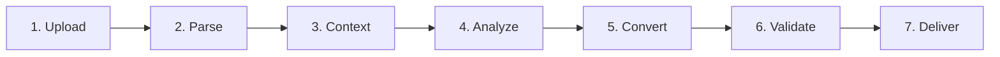
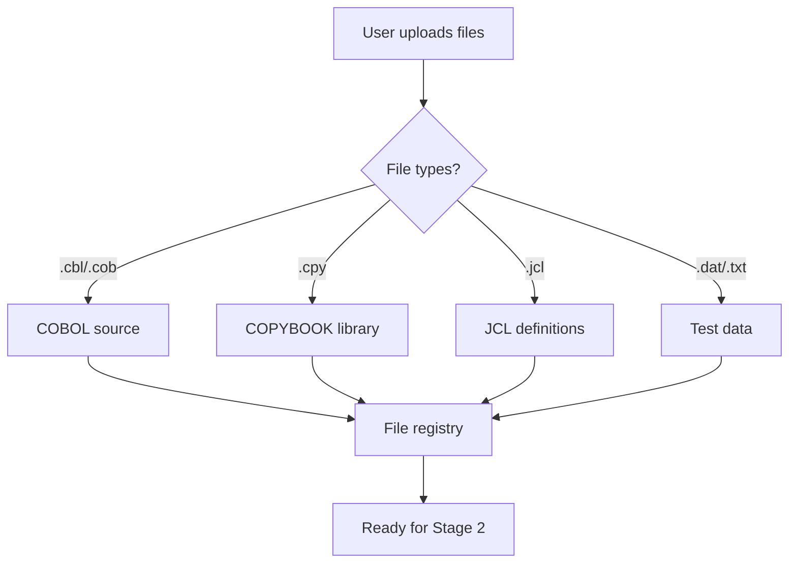
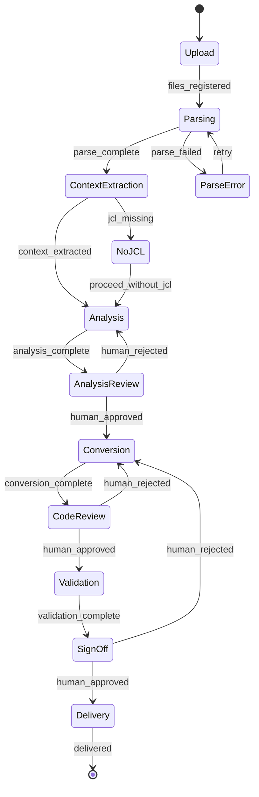
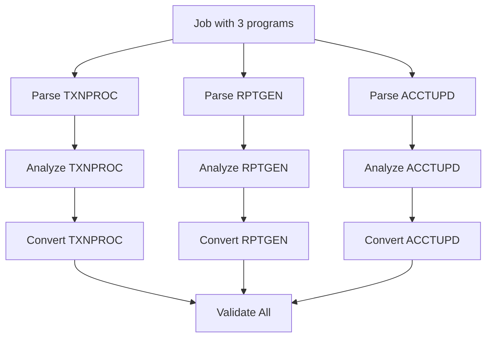

# End-to-End Workflow

## Overview

The modernization pipeline is a **sequential, stage-gated workflow** where each stage produces well-defined outputs that feed into the next. The pipeline is orchestrated by a LangGraph state machine that manages stage transitions, retries, and human review gates.

---

## Pipeline Stages



| Stage | Component | Type | Gate |
|-------|-----------|------|------|
| 1. Upload | File ingestion | System | Auto |
| 2. Parse | Parser Layer | Deterministic | Auto |
| 3. Context | JCL Parser | Deterministic | Auto |
| 4. Analyze | Analysis Agent | LLM | Human review |
| 5. Convert | Conversion Agent | LLM | Human review |
| 6. Validate | Validation Layer | Deterministic | Human sign-off |
| 7. Deliver | Package & export | System | Auto |

---

## Detailed Stage Breakdown

### Stage 1: Upload



**Inputs:** COBOL source files, COPYBOOKS, JCL definitions, test data (optional)
**Outputs:** Validated file registry with type classification
**Validation:** File type detection, encoding verification (EBCDIC → UTF-8 if needed)

---

### Stage 2: Parse

```
Input:  COBOL source + COPYBOOKS
Output: ast.json, variables.json, flow.json, dependencies.json
```

**Processing:**
1. Preprocess column layout (strip cols 1-6, 73-80)
2. Resolve COPYBOOKS (inline expansion)
3. Tokenize → parse → build AST
4. Extract symbol table, control flow, dependencies

**Auto-gate:** Parser must complete without fatal errors. Warnings are logged.

---

### Stage 3: Context Extraction

```
Input:  JCL definitions
Output: context.json (job structure, I/O mapping, step dependencies)
```

**Processing:**
1. Parse JOB/EXEC/DD statements
2. Expand PROCs
3. Build execution graph
4. Map DD names to COBOL file references

**Auto-gate:** JCL must parse successfully. Missing PROCs are flagged as warnings.

---

### Stage 4: Analyze (LLM)

```
Input:  ast.json + context.json + COBOL source
Output: analysis.json
```

**Processing:**
1. Construct prompt with parser outputs + JCL context
2. Send to Analysis Agent (LLM)
3. Validate response against JSON schema
4. Present to user for review

**Human gate:** User must review and approve analysis.json before proceeding.

---

### Stage 5: Convert (LLM)

```
Input:  analysis.json + ast.json + COBOL source + config
Output: Java source files + mapping_notes.md
```

**Processing:**
1. Apply deterministic syntax mapping (Layer 1)
2. Send to Conversion Agent for refactoring (Layer 2)
3. Validate Java compiles
4. Present to user for review

**Human gate:** User must review generated code before validation.

---

### Stage 6: Validate

```
Input:  Java source + COBOL source + test data
Output: validation_report.json
```

**Processing:**
1. L1: Static analysis (compile, lint)
2. L2: Structural coverage check
3. L3: Unit equivalence tests
4. L4: Integration comparison (if test data available)
5. L5: Edge case testing

**Human gate:** User must sign off on validation report.

---

### Stage 7: Deliver

```
Input:  Validated Java source + all artifacts
Output: Delivery package
```

**Package contents:**
```
delivery/
├── src/
│   └── com/bank/modernized/txnproc/
│       ├── TransactionProcessor.java
│       └── TransactionStatus.java
├── test/
│   └── com/bank/modernized/txnproc/
│       └── TransactionProcessorTest.java
├── docs/
│   ├── analysis.json
│   ├── mapping_notes.md
│   └── validation_report.json
├── original/
│   ├── TXNPROC.cbl
│   └── TXNPROC.jcl
└── pom.xml
```

---

## State Machine (LangGraph)



---

## Pipeline State Object

The pipeline maintains a state object that flows between stages:

```python
from typing import TypedDict, Optional, List

class PipelineState(TypedDict):
    # Stage 1
    cobol_files: List[str]
    copybook_files: List[str]
    jcl_files: List[str]
    test_data_files: List[str]

    # Stage 2
    ast: Optional[dict]
    variables: Optional[dict]
    control_flow: Optional[dict]
    dependencies: Optional[dict]

    # Stage 3
    jcl_context: Optional[dict]

    # Stage 4
    analysis: Optional[dict]
    analysis_approved: bool

    # Stage 5
    java_code: Optional[str]
    mapping_notes: Optional[str]
    code_approved: bool

    # Stage 6
    validation_report: Optional[dict]
    validation_approved: bool

    # Pipeline metadata
    current_stage: str
    errors: List[str]
    warnings: List[str]
    retry_count: int
```

---

## Retry & Fallback Strategy

| Failure Type | Retry Strategy | Fallback |
|-------------|---------------|----------|
| **Parser error** | Re-preprocess with alternative column handling | Manual COPYBOOK resolution |
| **LLM timeout** | Retry 3x with exponential backoff (2s, 4s, 8s) | Switch to fallback model |
| **LLM invalid JSON** | Re-prompt with schema reminder | Extract JSON from markdown wrapper |
| **LLM hallucination** | Re-prompt with stricter constraints | Human takeover |
| **Compilation failure** | Re-prompt with compiler errors | Human fix + re-validate |
| **Validation failure** | Root cause analysis → re-convert specific method | Human review of divergence |

---

## Parallel Processing

For multi-program conversions, independent programs can be processed in parallel:



Programs sharing COPYBOOKS or CALL dependencies must be processed in dependency order.

---

## CLI Interface

```bash
# Full pipeline
python -m pipeline.run \
  --cobol samples/TXNPROC.cbl \
  --jcl samples/TXNPROC.jcl \
  --copylib samples/copybooks/ \
  --target java \
  --output output/ \
  --auto-approve false

# Resume from a specific stage
python -m pipeline.run \
  --state pipeline_state.json \
  --resume-from analysis

# Batch processing
python -m pipeline.batch \
  --manifest batch_manifest.json \
  --parallel 4 \
  --output output/
```

---

## Progress Tracking

The dashboard displays real-time pipeline progress:

```
┌──────────────────────────────────────────────────────────┐
│  TXNPROC.cbl — Pipeline Progress                        │
├──────────┬──────────┬──────────┬──────────┬──────────────┤
│ ✅ Parse │ ✅ Context│ 🔄 Analyze│ ⬜ Convert│ ⬜ Validate │
│  2.1s    │  0.3s    │  running │          │              │
└──────────┴──────────┴──────────┴──────────┴──────────────┘
```

---

## Key Insight

> Structure → Meaning → Generation → Validation. Each stage builds on the previous, and each gate ensures quality before proceeding. The pipeline is designed to be **interruptible, resumable, and auditable** at every stage.