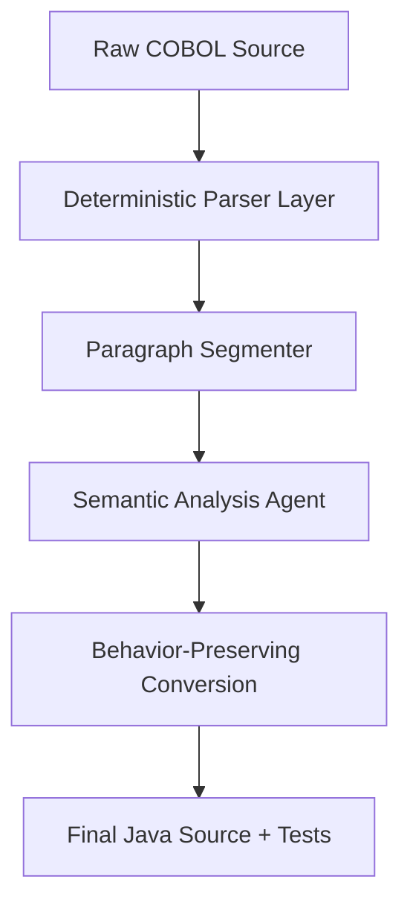

# COBOL Modernization Engine: High-Level Overview

## 1. The Modernization Pipeline

The modernization engine transforms legacy COBOL source code into semantically equivalent Java code through a multi-stage deterministic and AI-augmented pipeline.

## 2. Core Methodology: Structural vs. Semantic Truth

To ensure reliability and prevent AI hallucinations, we divide the modernization task into two distinct spheres:

### Structural Truth (Non-AI)
The **Parser Layer** and **Segmenter** are deterministic components. They extract **structure**, not meaning. They identify exactly what variables exist, which lines belong to which paragraphs, and the literal control flow (PERFORMs/GOTOs). 
> *Principle: Syntax is a deterministic facts-gathering exercise.*

### Semantic Truth (AI-Augmented)
The **Analysis Agent** consumes the structural facts and builds a semantic understanding. It identifies the **purpose** of a block (e.g., "This loop filters a report") and extracts **business rules** (e.g., "Maximum credit limit is 5000").
> *Principle: Business intent requires intelligent reasoning grounded in structural facts.*

## 3. Key Layers

| Layer | Responsibility | Technology | Output |
|-------|----------------|------------|--------|
| **Parser** | Structural extraction | Python Regex / Native Logic | Structural AST (JSON) |
| **Segmenter** | Code slicing & Data-flow | Dependency Tracking Logic | Paragraph Slices + Refs |
| **Analysis** | Semantic profiling | LLM (Gemini 2.0 Flash) | Semantic Context (JSON) |
| **Conversion** | Code generation | LLM (Behavioral Prompts) | Java + JUnit Tests |

## 4. Why This Architecture?

1. **Anti-Hallucination**: By passing the LLM a structured JSON "fact sheet" along with the code, we prevent it from guessing variable names or inventing logic that doesn't exist in the source.
2. **Scalability**: Deterministic segmentation allows us to process 10,000+ line COBOL monoliths that would otherwise exceed LLM context windows.
3. **Traceability**: Every Java method generated can be traced back to a specific COBOL paragraph identified by the parser.
4. **Behavioral Fidelity**: We prioritize preserving runtime behavior (pre-test loops, 1-based indexing) over making the Java look "modern" at the cost of correctness.
