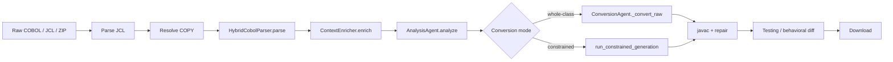
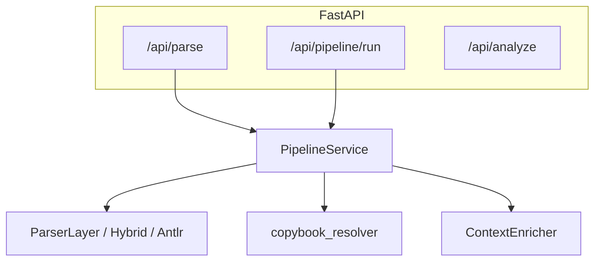

# Architecture and pipeline (stages, data flow, schemas)

## 1.1 High-level goal

The service turns **COBOL (+ optional JCL)** into **structured JSON** (AST-like), then optional **semantic analysis** and **Java conversion**. The work in this project focused on making the **deterministic parser** reliable for real programs (FILLER, copybooks, multi-line statements) and on **wiring the full path** (JCL → COPY → parse → JCL-aware bindings).

## 1.2 Pipeline stages (full path)

When you call `PipelineService.run_full_pipeline(cobol_source, jcl_source)`:

| Stage | Component | Input | Output / effect |
|-------|-----------|--------|-----------------|
| 1 | `parse_jcl` | JCL text | `JCLManifest` (job, steps, `copylib_paths`, DD bindings) |
| 2 | `resolve_copybooks` | Raw COBOL + manifest | Expanded source, `resolved_copybooks` audit, errors/warnings |
| 3 | `CobolParser.parse` | Expanded source + copybook metadata | Parser JSON (divisions, symbols, operations, control flow, dependencies) |
| 4 | `ContextEnricher.enrich` | Parser JSON + JCL dict | `data_mappings`, `execution_context`, nested `ast` |

**Why JCL matters:** `SYSLIB` in JCL is a **dataset name**, not a Windows path. Tests prepend a real `copybooks/` directory to `COPY_LIBRARY_CONFIG["default"]` so `COPY RPTHDCPY` resolves to a file on disk.

## 1.3 Simplified schema: parser output (`ParserLayer.parse`)

Top-level keys returned on success:

| Key | Type | Meaning |
|-----|------|---------|
| `program_name` | `string \| null` | From `PROGRAM-ID` |
| `source_format` | `"fixed" \| "free"` | Heuristic detection |
| `preflight_errors` | `string[]` | **Fatal** structural issues only (empty = parse continued) |
| `divisions` | `string[]` | Division names found |
| `sections` | mixed | Section headers / structure |
| `paragraphs` | `object[]` | Paragraph index entries |
| `symbol_table` | `object[]` | Data names, PIC, hierarchy |
| `control_flow` | `object` | `branches`, `loops`, `calls`, `gotos` |
| `operations` | `object[]` | MOVE, COMPUTE, IF, DISPLAY, … |
| `dependencies` | `object` | `copybooks`, `files`, `file_bindings`, `external_calls` |
| `risk_flags` | `string[]` | e.g. `loop_logic`, `arithmetic_expression` |
| `warnings` | `object[]` | Structured warnings (codes like `W002`, `W007`, …) |

**Preflight failure response:** If `preflight_errors` is non-empty, most structural fields are **empty arrays** (early exit).

## 1.4 Schema: enriched output (`run_full_pipeline`)

`ContextEnricher` wraps the parser JSON:

| Key | Meaning |
|-----|---------|
| `program_name` | Copied from AST |
| `execution_context` | Job name, matched JCL step, PARM, etc. |
| `data_mappings` | Logical file → physical dataset (from JCL DD when matched) |
| `warnings` | Enrichment warnings (e.g. unresolved DD) |
| `ast` | **Full parser output** (same as stage 3 JSON) |

Integration tests assert on `enriched["ast"]` and `enriched["data_mappings"]` for CUSTMGR.

## 1.5 Component diagram (services)

`PipelineService` chooses the parser implementation from config (`PARSER_BACKEND`: `heuristic`, `hybrid`, `antlr`).

## 1.6 COPY resolution vs parser

| Concern | Where it lives |
|---------|----------------|
| Finding `.cpy` on disk / expanding `COPY` | `resolve_copy_books` |
| Recording copybook names after expansion | Parser merges resolver audit + raw-source markers (`>>> COPY … EXPANDED`) |
| Parsing expanded COBOL | `ParserLayer` |

---

*Next: [02-parser-layer-and-fixes.md](./02-parser-layer-and-fixes.md)*
