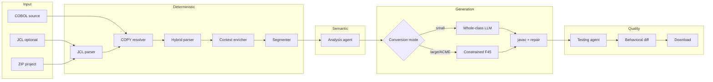

# 02 — Pipeline and Data Flow

## End-to-end flow



Not every path runs every box. Single-file debug may skip JCL. Behavioral diff requires local
`cobc` and `javac`.

---

## Stage summary

| # | Stage | Input | Output | Doc |
|---|---|---|---|---|
| 1 | JCL parse | JCL text | `JCLManifest` | [04](./04-jcl-and-copy-resolution.md) |
| 2 | COPY resolve | Raw COBOL + manifest | Expanded source, audit | [04](./04-jcl-and-copy-resolution.md) |
| 3 | COBOL parse | Expanded source | Parser JSON | [05](./05-cobol-parsing.md) |
| 4 | Context enrich | Parser JSON + JCL | Enriched bindings | [06](./06-context-enrichment-and-segmentation.md) |
| 5 | Segment | Parser + analysis | Paragraph slices | [06](./06-context-enrichment-and-segmentation.md) |
| 6 | Analyze | Source + parser JSON | Analysis JSON | [07](./07-analysis-agent.md) |
| 7 | Convert | Source + parser + analysis | Java source | [08](./08-java-conversion.md) |
| 8 | Test / validate | Java + COBOL + JSON | Test report | [09](./09-testing-validation-and-download.md) |
| 9 | Download | Java artifacts | ZIP / file | [09](./09-testing-validation-and-download.md) |

---

## Pipeline approaches

### Approach 1 — Core parse → analyze → convert

```text
COBOL → parse_cobol → analyze_cobol → convert_cobol
```

| API | Service method |
|---|---|
| `POST /api/parse` | `PipelineService.parse_cobol()` |
| `POST /api/analyze` | `PipelineService.analyze_cobol()` |
| `POST /api/convert` | `PipelineService.convert_cobol()` |

Each layer is independently testable. The frontend can display parser JSON before analysis.

### Approach 2 — Full internal pipeline (JCL + COPY)

```text
JCL → parse_jcl_source
COBOL → resolve_copybooks → parse → context enrichment
```

| Service method | Role |
|---|---|
| `parse_jcl_source()` | Extract job steps, DD bindings, SYSLIB paths |
| `resolve_copybooks()` | Expand COPY statements |
| `run_full_pipeline()` | JCL + COPY + parse + enrich in one call |

Required when COPY books or JCL file bindings affect conversion.

### Approach 3 — Mode-based pipeline

`POST /api/pipeline/run` via `run_pipeline_mode()`:

| Mode | Parse | Analyze | Convert context |
|---|---|---|---|
| `full` | yes | yes | parser + analysis |
| `parse_only` | yes | no | parser only |
| `parse_analyse` | yes | yes | parser + analysis |
| `analyse_only` | no | yes | analysis only |
| `convert_only` | optional | optional | provided or generated |
| `no_parse` | no | no | raw COBOL only |

All supported modes return `java_source` in the current implementation.

### Approach 4 — Project batch

`POST /api/project/upload` → file tree → `POST /api/project/pipeline`

Handles ZIP with multiple COBOL files, copybooks, and JCL. See [10](./10-project-batch-upload.md).

### Approach 5 — Smart convert

`POST /api/smart-convert` — convenience endpoint that runs parse/analyze if not provided,
then converts with full context.

---

## Context modes for conversion

| Mode | COBOL source | Parser JSON | Analysis JSON |
|---|---|---|---|
| Raw only | yes | no | no |
| Parser-guided | yes | yes | no |
| Analysis-guided | yes | no | yes |
| **Full context** | yes | yes | yes |

**Recommended default:** full context (`COBOL + parser + analysis`). Raw COBOL is **always**
included in the conversion prompt even when structured context is present.

---

## Data contracts between stages

Artifacts flow as JSON dictionaries. Cross-cutting schema definitions:
[reference/schema-contracts.md](./reference/schema-contracts.md).

```text
JCLManifest
  ↓
expanded COBOL + resolved_copybooks[]
  ↓
parser_output { symbol_table, control_flow, operations, ... }
  ↓
analysis_output { business_rules, sections, risk_flags, ... }
  ↓
java_source (string) + conversion_metadata
  ↓
test_report { parser_tests, conversion_tests, behavioral_tests }
```

---

## Orchestration code path

```text
app/api/routes/modernization.py
  → PipelineService (app/services/pipeline_service.py)
    → create_parser() → HybridCobolParser | ParserLayer | AntlrCobolParser
    → ModernizationAgents (app/agents/facade.py)
      → AnalysisAgent, ConversionAgent
    → ValidationService
    → ContextEnricher
```

---

## Next documents

- [04 — JCL and COPY](./04-jcl-and-copy-resolution.md) — first pipeline stages
- [08 — Java conversion](./08-java-conversion.md) — generation modes
