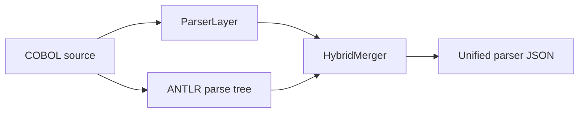

# 05 — COBOL Parsing

Deterministic structural extraction from COBOL source. No business semantics — only facts.

**Code:** `app/parsers/factory.py`, `hybrid_parser.py`, `cobol_parser.py` (`ParserLayer`)

---

## Parser factory

```python
create_parser(load_config())  # reads PARSER_BACKEND
```

| `PARSER_BACKEND` | Class | Behavior |
|---|---|---|
| **`hybrid`** (default) | `HybridCobolParser` | Heuristic baseline + ANTLR merge |
| `heuristic` | `ParserLayer` | Regex/column-aware extraction only |
| `antlr` | `AntlrCobolParser` | Grammar validation without full merge |



If ANTLR runtime is missing, hybrid returns heuristic output with
`parser_backend: "hybrid_degraded"`.

---

## Parser output contract

Top-level fields:

| Field | Content |
|---|---|
| `program_name` | PROGRAM-ID or inferred name |
| `source_format` | `fixed` or `free` |
| `divisions` | IDENTIFICATION, DATA, PROCEDURE, … |
| `sections` / `paragraphs` | Named procedure structure |
| `symbol_table` | Data items with PIC, level, kind |
| `control_flow` | Branches, loops, calls, GO TOs |
| `operations` | MOVE, COMPUTE, ADD, DISPLAY, … |
| `dependencies` | Files, copybooks, external calls |
| `risk_flags` | Parser-detected modernization risks |
| `warnings` | Non-fatal issues |
| `preflight_errors` | Fatal structural blockers |

Full JSON schema: [reference/schema-contracts.md](./reference/schema-contracts.md).

---

## Preflight validation

Runs **before** full extraction. Fatal errors → empty structure + `preflight_errors`.

| Check | Example |
|---|---|
| Duplicate data names | Two `WS-COUNT` at same level |
| Undeclared PERFORM index | `PERFORM VARYING I` without `I` in symbol table |
| Reserved word paragraphs | Paragraph named `MOVE` |
| FD / SELECT consistency | SELECT without matching FD |

Downstream analysis sets `preferred_strategy: "halted"` when preflight fails.

---

## Key ParserLayer behaviors

| Feature | Why it matters |
|---|---|
| FILLER handling | Multiple FILLERs per record — not treated as duplicate names |
| Multi-line statements | Statements spanning lines without column-7 continuation |
| PIC decoding | `pic_decoded` → Java type hints for conversion |
| COMPUTE rounded flag | `rounded: true/false` per operation |
| DISPLAY references | Unquoted data names extracted as references |

---

## API

```http
POST /api/parse
Content-Type: application/json

{ "source_code": "..." }
```

Service path: `PipelineService.parse_cobol()` → `self.parser.parse(source_code)`.

---

## Configuration

| Variable | Default |
|---|---|
| `PARSER_BACKEND` | `hybrid` |

---

## Why deterministic parsing first

| Benefit | Explanation |
|---|---|
| Stable output | Same input → same JSON (no model randomness) |
| UI inspection | Parser page shows exact structure |
| Testable | pytest asserts on symbol_table, control_flow |
| Grounds LLM | Analysis and conversion cite parser evidence |

---

## Related documents

- [04 — JCL and COPY](./04-jcl-and-copy-resolution.md) — input preparation
- [07 — Analysis agent](./07-analysis-agent.md) — consumes parser JSON
- [reference/developer-guide.md](./reference/developer-guide.md) — extending ParserLayer
