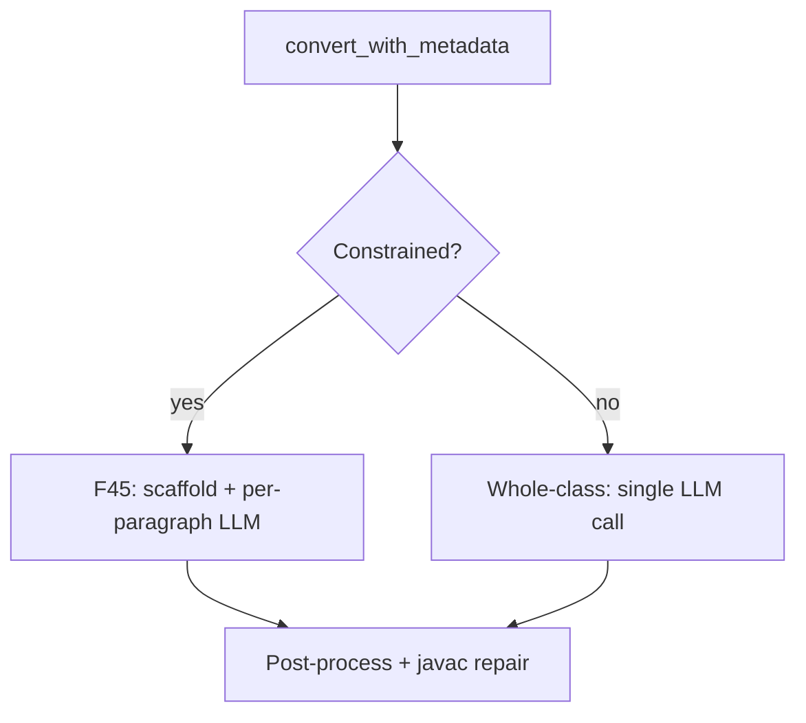

# 08 — Java Conversion

Generates plain Java from COBOL source plus structured context. Two generation modes.

**Code:** `app/agents/conversion_agent.py`, `app/converters/constrained_generation.py`,
`app/converters/java_class_builder.py`

---

## Mode selection

`ConversionAgent.convert_with_metadata()` routes via `should_use_constrained_generation()`:



| Mode | Trigger | Implementation |
|---|---|---|
| **Whole-class** | Not in mandatory list AND ≤400 non-blank lines | `_convert_raw()` — one prompt, full class |
| **Constrained (F45)** | `LOANEVAL`, `RECOVRY`, `RPTMONTH`, `RISKSCOR`, OR >400 lines | `run_constrained_generation()` |

Mandatory list and line threshold: `app/converters/constrained_generation.py`.

---

## Constrained F45 mode (detail)

```text
1. java_class_builder builds class skeleton (package, imports, method stubs)
2. For each paragraph → independent LLM call (method body only)
3. Symbol table injected into every prompt
4. splice_method_body() merges LLM output into scaffold
5. java_pre_write_validator + javac compile/repair loop
```

**Why:** Large programs mix paragraph contexts in a single prompt. Scaffold guarantees
class structure; per-paragraph calls keep LLM focus narrow.

---

## Whole-class mode (detail)

```text
1. Build prompt: raw COBOL + parser JSON + analysis JSON + conversion config
2. Single LLM call → full Java class string
3. Post-process + javac repair
```

**Why:** Faster and sufficient for small programs (e.g. `RISKSCOR`, `AUTOPREM`).

---

## Context inputs (both modes)

| Input | Always? |
|---|---|
| Raw COBOL source | **Yes** |
| Parser JSON | When mode provides it |
| Analysis JSON | When mode provides it |
| Conversion config | Derived from parser + analysis |

Conversion config includes:

| Field | Source |
|---|---|
| `target_language` | `java` |
| `java_version` | 17 |
| `framework` | `none` when `JAVA_PROJECT_PROFILE=plain_java` |
| `package_name` | From program name |
| `decimal_strategy` | `BigDecimal` |
| `io_strategy` | `buffered` if file deps, else `in-memory` |

Prompt explicitly states which context layers are present and forbids inventing missing facts.

---

## Post-conversion pipeline (shared)

```text
java_pre_write_validator
  → javac compile
  → repair loop (LLM or deterministic fixes)
  → post_process_java()
  → optional smoke test
```

---

## API

```http
POST /api/convert
POST /api/pipeline/run
POST /api/smart-convert
```

```json
{
  "source_code": "...",
  "parser_output": {},
  "analysis_output": "..."
}
```

---

## Configuration

| Variable | Default |
|---|---|
| `JAVA_PROJECT_PROFILE` | `plain_java` |
| `LLM_PROVIDER` | `auto` |
| `ANTHROPIC_MODEL_CONVERSION` | same as analysis model |

Supported providers: Anthropic, OpenAI, OpenRouter, Google. Stub fallback when no key.

---

## COBOL → Java mapping (summary)

| COBOL | Java strategy |
|---|---|
| `PIC 9(n)V99` | `BigDecimal` |
| `PERFORM UNTIL` | `while` loop |
| `PERFORM VARYING` | `for` loop |
| `EVALUATE` | `switch` or if-else chain |
| `COMPUTE ROUNDED` | `BigDecimal` with rounding mode |
| File I/O | `BufferedReader` / `BufferedWriter` |

---

## Related documents

- [07 — Analysis agent](./07-analysis-agent.md) — upstream context
- [09 — Testing](./09-testing-validation-and-download.md) — verifies output
- [03 — Design decisions](./03-design-decisions.md) — why two modes
