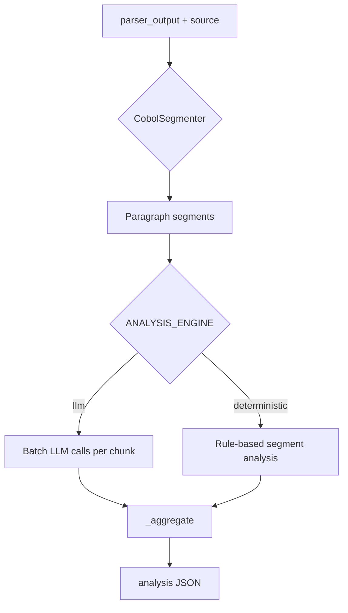

# Analysis Agent: Semantic Aggregator and Profiler

## 1. Purpose

`AnalysisAgent` (`app/agents/analysis_agent.py`) consumes parser output and COBOL source to
produce semantic context for conversion. It is the **semantic aggregator** between
deterministic parsing and LLM conversion.

## 2. Engines

| Engine | Env | Behavior |
|---|---|---|
| `llm` (default) | `ANALYSIS_ENGINE=llm` | Batched paragraph LLM calls + global-purpose inference |
| `deterministic` | `ANALYSIS_ENGINE=deterministic` | Rule-based `_analyze_segment()` per paragraph |
| halted | `preflight_errors` present | Returns halted strategy without full analysis |

LLM path sets `analysis_engine: "llm"`, `analysis_revision: 2`.
Deterministic path sets `analysis_engine: "deterministic"`, `analysis_revision: 3`.

On LLM failure, falls back to deterministic unless `ANALYSIS_STRICT_LLM=1`.

## 3. Methodology

### Stage A: Segment-level analysis

For each paragraph segment:

- **Role classification** — entry point, orchestrator, data processor, termination
- **Business rule extraction** — logic verifiable in source text
- **Local risks** — loops, branches, REDEFINES, GO TO

### Stage B: Relationship analysis

- Called-by / calls graph from control flow
- Dead code detection (unreachable paragraphs)

### Stage C: Program aggregation

- `global_purpose` — one-sentence business goal
- `complexity` — low / medium / high from branch density, I/O, control flow
- `conversion_guidance` — preferred strategy, chunking hints

## 4. Grounding principle

The agent must not invent business rules. All extracted rules must be verifiable in the
COBOL source or parser output.

## 5. Output contract (key fields)

| Field | Description |
|---|---|
| `global_purpose` | Program business goal |
| `complexity` | `low`, `medium`, or `high` |
| `sections` | Per-paragraph profiles |
| `business_rules` | Extracted rules with evidence |
| `conversion_guidance` | Strategy hints for conversion agent |
| `data_flow_summary` | Global inputs, outputs, shared state |
| `risk_points` | Identified modernization risks |

## 6. Caching

Optional disk cache via `app/services/analysis_cache.py` when `ANALYSIS_ENABLE_ANALYSIS_CACHE=1`.

Prompt: `app/agents/analysis_prompt.py` (`ANALYSIS_AGENT_SYSTEM_PROMPT`).
