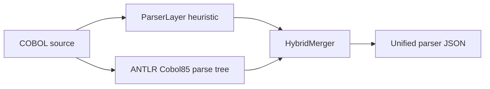
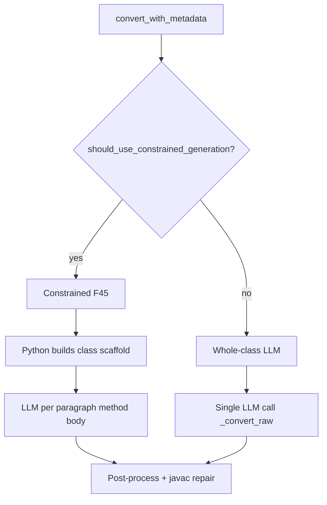

# Architecture 02 - Parser, Analysis, and Conversion Logic

This document explains why parser, analysis, and conversion are separate stages.

## Parser Stage

The parser is deterministic. Its job is not to understand business meaning. Its job is to extract structure.

### Hybrid parser (default)

The active backend is selected by `create_parser()` in `app/parsers/factory.py`. The default
`PARSER_BACKEND` is **`hybrid`**, which uses `HybridCobolParser`:

| Backend | Class | Behavior |
|---|---|---|
| `hybrid` | `HybridCobolParser` | Heuristic baseline + ANTLR visitor merge (default) |
| `heuristic` | `ParserLayer` | Regex/column-aware extraction only |
| `antlr` | `AntlrCobolParser` | ANTLR validation path without full merge |

If ANTLR runtime or generated artifacts are missing, hybrid mode degrades to heuristic output
with `parser_backend: "hybrid_degraded"`.

It produces:

- `program_name`
- `source_format`
- `divisions`
- `sections`
- `paragraphs`
- `symbol_table`
- `control_flow`
- `operations`
- `dependencies`
- `risk_flags`
- `warnings`

Why we need it:

- COBOL syntax is old and context-heavy
- source format can be fixed or free
- data declarations drive Java types
- control flow drives method and loop conversion
- dependencies drive I/O and external-call conversion

Why this approach:

- deterministic parser output is stable
- output is easy to inspect in UI
- parser warnings help identify risky areas before LLM conversion
- parser output can be used without analysis or conversion

## Preflight Validation Inside Parser

Before full parse results are trusted, the parser checks for blocking structural problems.

Examples:

- duplicate data names
- selected files without matching FD entries
- undeclared `PERFORM VARYING` indexes
- reserved words used as paragraph names

Why we need it:

- downstream stages should not reason over broken source
- conversion should not continue blindly when structural evidence is unsafe

Why this approach:

- fail early for structural issues
- return the same parser contract with `preflight_errors`
- let analysis choose a halted strategy

## Analysis Stage

`AnalysisAgent` (`app/agents/analysis_agent.py`) turns parser structure and source text into
semantic context. Engine selection is controlled by `ANALYSIS_ENGINE` (default: **`llm`**).

| Engine | When | Output marker |
|---|---|---|
| `llm` | LLM provider configured | `analysis_engine: "llm"`, `analysis_revision: 2` |
| `deterministic` | `ANALYSIS_ENGINE=deterministic` or LLM fallback | `analysis_engine: "deterministic"`, `analysis_revision: 3` |
| halted | `preflight_errors` non-empty | `preferred_strategy: "halted"`, `analysis_revision: 0` |

LLM analysis batches paragraph segments via `CobolSegmenter` and `chunk_program()`. On LLM
failure, the agent falls back to deterministic analysis unless `ANALYSIS_STRICT_LLM=1`.

It produces:

- `global_purpose`
- `complexity`
- `complexity_drivers`
- `sections`
- `business_rules`
- `file_io_paragraphs`
- `loop_paragraphs`
- `risk_points`
- `risk_flags`
- `conversion_guidance`
- `data_flow_summary`
- `warnings`

Why we need it:

- parser tells what exists
- analysis explains why it matters
- conversion needs business rules, risks, and guidance

Why this approach:

- analysis remains grounded in parser output and source text
- business rules are extracted from structural evidence
- it avoids inventing rules when evidence is absent
- complexity and risk guide conversion strategy

## Segment-Based Analysis

`AnalysisAgent` uses `CobolSegmenter`.

The segmenter gives paragraph-focused context:

- source lines
- symbol reads/writes
- file I/O presence
- loop presence
- branch presence
- GO TO presence

Why we need it:

- COBOL programs are paragraph-oriented
- business behavior is often localized in paragraphs
- conversion needs paragraph-to-method mapping

Why this approach:

- paragraph analysis is easier to explain
- risk and business rules can be mapped to named COBOL sections
- generated Java can preserve traceability to COBOL paragraphs

## Conversion Stage — Two Modes

`ConversionAgent.convert_with_metadata()` routes to one of two generation strategies via
`should_use_constrained_generation()` in `app/converters/constrained_generation.py`:

| Mode | Trigger | Implementation |
|---|---|---|
| **Whole-class** | Program not in mandatory list and ≤400 non-blank lines | `ConversionAgent._convert_raw()` — one LLM prompt for entire Java class |
| **Constrained (F45)** | `LOANEVAL`, `RECOVRY`, `RPTMONTH`, `RISKSCOR`, or >400 lines | `run_constrained_generation()` — scaffold from `java_class_builder.py`, LLM fills method bodies |

Both modes share the same post-conversion pipeline: Java pre-write validation, compile/repair,
post-processing, and optional smoke test.

### Context inputs (both modes)

The conversion agent builds a prompt with:

- raw COBOL source
- context mode
- parser output JSON
- analysis output JSON
- conversion configuration JSON

Why raw COBOL is always included:

- parser and analysis may omit syntax details
- conversion still needs exact source lines
- missing context should not remove source evidence

Why context modes exist:

- `COBOL source only` helps fallback conversion
- `COBOL + parser` tests structural conversion without semantic analysis
- `COBOL + analysis` tests business-guided conversion without parser constraints
- `COBOL + parser + analysis` gives maximum context

Why this approach:

- prompt tells the LLM exactly which context exists
- prompt explicitly says not to invent missing parser or analysis facts
- mode comparison helps debug bad conversions

## Conversion Configuration

The conversion agent derives config from parser and analysis:

- target language: Java
- Java version: 17
- framework: `none` when `JAVA_PROJECT_PROFILE=plain_java` (default)
- package name from program name
- decimal strategy: BigDecimal
- `io_strategy`: `buffered` when file dependencies exist, else `in-memory`
- complexity hint from analysis

Why we need it:

- Java generation needs consistent conventions
- numeric behavior is critical in COBOL
- file programs need different Java structure from in-memory programs

Why this approach:

- config is generated from backend evidence
- prompt stays consistent across providers
- provider-specific code does not change conversion rules

## LLM Provider Abstraction

`ConversionAgent` supports (via `app/services/llm_transport.py`):

- Anthropic
- OpenAI
- OpenRouter
- Google (LangChain)
- stub fallback when no key is configured

Why we need it:

- users may have different API keys
- local dev should not crash without an LLM key
- frontend can still show conversion availability status

Why this approach:

- provider selection is environment-driven
- runtime status reports model and readiness
- stub response keeps the backend usable in demos and tests

