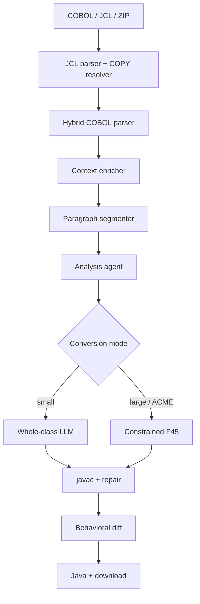

# COBOL Modernization Engine: High-Level Overview

## 1. The modernization pipeline

## 2. Structural vs semantic truth

### Structural truth (deterministic)

The **Parser Layer** (`ParserLayer` + optional ANTLR merge) and **Segmenter** extract
structure only: variables, paragraphs, control flow, operations. No LLM involvement.

> Syntax is a deterministic facts-gathering exercise.

### Semantic truth (AI-augmented)

The **Analysis Agent** builds business meaning from structural facts: purpose, rules, risks.

> Business intent requires reasoning grounded in structural evidence.

## 3. Key layers

| Layer | Responsibility | Technology | Output |
|---|---|---|---|
| **JCL + COPY** | File bindings, expanded source | `jcl_parser.py`, `copybook_resolver.py` | `JCLManifest`, expanded COBOL |
| **Parser** | Structural extraction | `ParserLayer` + ANTLR hybrid | Parser JSON |
| **Enricher** | JCL-aware bindings | `context_enricher.py` | `data_mappings`, `execution_context` |
| **Segmenter** | Paragraph slices | `segmenter.py` | Segment manifests |
| **Analysis** | Semantic profiling | LLM or deterministic rules | Analysis JSON |
| **Conversion** | Java generation | Whole-class or constrained F45 | Plain Java source |
| **Testing** | Quality gates | Testing agent + behavioral diff | Test reports |

## 4. Why this architecture

1. **Anti-hallucination** — LLM receives structured JSON facts, not raw COBOL alone.
2. **Scalability** — Constrained mode processes large monoliths paragraph-by-paragraph.
3. **Traceability** — Java methods map back to COBOL paragraphs.
4. **Behavioral fidelity** — GnuCOBOL vs Java stdout comparison catches semantic drift.

## 5. Active codebase

| Component | Location |
|---|---|
| Backend | `cobol-modernization-service/` |
| Frontend | `cobol-modernization-dashboard/` |
| Test case | `acme-bank-v3/` |
| Architecture docs | `docs/architecture/` |
