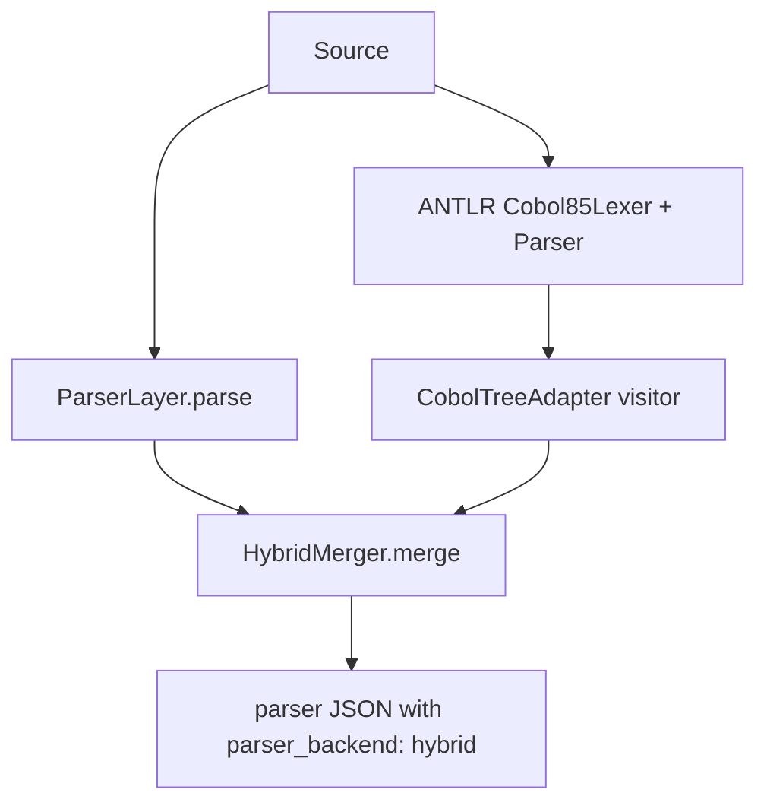

# Parser Layer: Structural Extraction Specification

## 1. Purpose

The Parser Layer transforms raw COBOL text into a **deterministic, structured JSON**
representation. It is the first technical filter in the pipeline and does not use LLMs.

**Default backend:** `HybridCobolParser` (`PARSER_BACKEND=hybrid`).

## 2. Parser backends

| Backend | Class | Module | Description |
|---|---|---|---|
| `hybrid` (default) | `HybridCobolParser` | `app/parsers/hybrid_parser.py` | Heuristic + ANTLR merge |
| `heuristic` | `ParserLayer` | `app/parsers/cobol_parser.py` | Regex/column-aware only |
| `antlr` | `AntlrCobolParser` | `app/parsers/antlr_parser.py` | ANTLR grammar validation |

Factory: `create_parser(config)` in `app/parsers/factory.py`.

### Hybrid merge flow



Key modules:

| Module | Role |
|---|---|
| `app/parsers/cobol_parser.py` | `ParserLayer` — heuristic extraction |
| `app/parsers/generated/parse_tree_adapter.py` | `parse_with_hybrid()`, `run_antlr_pass()` |
| `app/parsers/cobol_tree_adapter.py` | `CobolTreeAdapter` — ANTLR visitor |
| `app/parsers/hybrid_merger.py` | `HybridMerger` — deduplicate and merge partials |

## 3. Lexical and syntactic processing

### Preprocessing

- **Fixed format:** sequence area (cols 1–6), indicator (col 7), body (cols 8–72)
- **Free format:** lines starting with `*` or `*>` skipped
- Multi-line statement merging inside PROCEDURE DIVISION (`_combine_logical_statements`)

### Extraction engines (`ParserLayer`)

1. **Division and section mapping** — program boundaries
2. **Symbol table builder** — levels, PIC, REDEFINES, OCCURS, kind classification
3. **Control flow extractor** — PERFORM, CALL, GO TO with conditional context
4. **Operations parser** — MOVE, ADD, READ, WRITE, COMPUTE, DISPLAY, etc.

## 4. Deterministic-first rationale

| Reason | Benefit |
|---|---|
| No hallucination | Regex/grammar parsers capture only what exists |
| Consistency | Repeated parses yield identical JSON |
| Cost/speed | Local parsing is near-instant |

## 5. Structural JSON contract

```json
{
  "program_name": "...",
  "source_format": "fixed",
  "preflight_errors": [],
  "symbol_table": [
    { "name": "AMT", "pic": "9(5)V99", "kind": "numeric" }
  ],
  "control_flow": {
    "calls": [{ "from": "PARA-A", "to": "PARA-B", "conditional": true }],
    "loops": [{ "type": "PERFORM_UNTIL", "until": "I > 10" }]
  },
  "operations": [
    { "type": "MOVE", "target": "X", "value": "Y" }
  ],
  "dependencies": {
    "copybooks": [],
    "files": [],
    "external_calls": []
  },
  "parser_backend": "hybrid",
  "warnings": [
    { "code": "W001", "message": "Unused variable detected" }
  ]
}
```

## 6. Preflight validation

`_preflight_check()` halts parsing when structural issues would corrupt downstream stages:

- duplicate data names (excluding `FILLER`)
- FILE-CONTROL without matching FD
- undeclared `PERFORM VARYING` index variables
- reserved words used as paragraph names

On failure: same top-level contract with populated `preflight_errors` and empty structural arrays.
