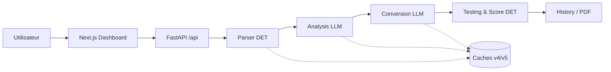
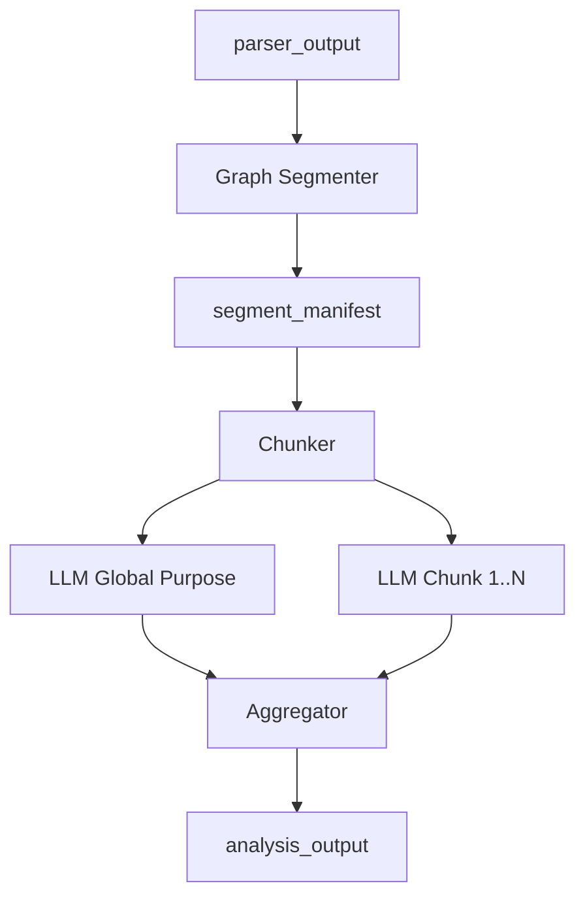

# Guide d’architecture — Présentation Draw.io

Document de référence pour construire des diagrammes **macro** et **micro** de la plateforme **COBOL Modernizer** (backend FastAPI + dashboard Next.js).  
Chaque section indique : **quoi dessiner**, **entrées/sorties**, **décisions (losanges)**, **boucles**, et **icônes Draw.io** suggérées.

---

## 1. Message clé pour la présentation

> La modernisation n’est pas « un prompt LLM sur du COBOL ».  
> C’est un **pipeline en étapes** : extraction **déterministe** (parser, segmenter, tests) + enrichissement **sémantique** (analyse LLM par chunks) + génération **Java** (monolithique ou **contrainte par paragraphe**) + **validation** (score, diff comportemental, fiabilité).

**Valeur architecture :**

| Principe | Bénéfice |
|-----------|----------|
| Contrats JSON stables entre étapes | Traçabilité, rejeu, cache |
| Parser / segmenter / scorer **sans LLM** | Reproductibilité, audit |
| Analyse et conversion **grounded** sur le parser | Moins d’hallucinations |
| Tests multi-couches | Confiance client (COBOL vs Java) |
| Modes Single File / Project | Demo ciblée ou lot ACME |

---

## 2. Légende Draw.io (à créer une fois, réutiliser partout)

### 2.1 Formes recommandées

| Élément | Forme Draw.io | Couleur suggérée | Usage |
|---------|---------------|------------------|--------|
| **Composant logiciel** | Rectangle arrondi | Bleu `#4A90D9` | Services, agents |
| **Déterministe** | Rectangle + badge « DET » | Vert `#2E7D32` | Parser, segmenter, scorer |
| **LLM** | Rectangle + icône nuage / éclair | Violet `#7B1FA2` | AnalysisAgent, ConversionAgent |
| **Cache disque** | Cylindre | Gris `#78909C` | `.analysis_cache`, `.conversion_cache` |
| **Entrée utilisateur** | Parallélogramme | Jaune `#F9A825` | `.cbl`, ZIP projet, stdin test |
| **Sortie / artefact** | Document (feuille) | Orange `#EF6C00` | `parser_output.json`, Java, PDF |
| **Décision** | Losange | Rouge clair `#E57373` | `if preflight`, `constrained?`, `cache hit?` |
| **Boucle** | Flèche courbe + label `FOR EACH` | — | Paragraphes, chunks, programmes |
| **API HTTP** | Rectangle double bordure | Bleu foncé | `POST /api/parse`, etc. |
| **Frontend** | Rectangle zone (swimlane) | Indigo `#3F51B5` | Next.js dashboard |
| **Toolchain locale** | Rectangle pointillé | Gris | `cobc`, `javac`, `java` |

### 2.2 Icônes / pictogrammes (bibliothèque Draw.io)

| Concept | Icône / astuce Draw.io |
|---------|-------------------------|
| **Chunk** | Empiler 3 petits rectangles + label `Chunk N` |
| **Paragraphe COBOL** | Bloc avec nom `2100-VALIDATE-QUOTE` |
| **Segment** | Conteneur (swimlane interne) `SEG_01` |
| **Symbole / PIC** | Table mini « symbole → type Java » |
| **COPY book** | Fichier lié par flèche pointillée |
| **JCL** | Bandeau « batch / DD » |
| **Score** | Jauge ou `88/100` |
| **Parité stdout** | Deux terminaux COBOL / Java → `diff` |
| **Retry LLM** | Flèche boucle avec `↻ compliance` (optionnel, désactivé par défaut perf) |

### 2.3 Flux de données (notation sur les flèches)

Étiqueter les flèches avec le **nom du contrat**, par ex. :

- `COBOL source (text)`
- `parser_output (JSON)`
- `analysis_output (JSON)`
- `java_source (text)`
- `behavioral_diff_report (JSON)`

---

## 3. Diagramme MACRO — Vue système globale

### 3.1 Titre slide

**« COBOL Modernizer — Architecture macro (staged pipeline) »**

### 3.2 Zones (swimlanes horizontales ou verticales)

```
┌─────────────────────────────────────────────────────────────────────────┐
│  COUCHE PRÉSENTATION — Next.js Dashboard (127.0.0.1:3000)               │
│  Pages: Single File | Project | Testing | History | Cockpit             │
└───────────────────────────────┬─────────────────────────────────────────┘
                                │ REST JSON /api/*
┌───────────────────────────────▼─────────────────────────────────────────┐
│  COUCHE API — FastAPI (127.0.0.1:8010)                                  │
│  PipelineService · routes modernization · testing · project upload      │
└───────────────────────────────┬─────────────────────────────────────────┘
                                │
        ┌───────────────────────┼───────────────────────┐
        ▼                       ▼                       ▼
   DÉTERMINISTE            HYBRIDE LLM              QUALITÉ
   Parser JCL COPY         Analyze Convert          Test Score Reliability
   Segment Chunk           (+ caches)               Behavioral diff
```

### 3.3 Blocs à placer (gauche → droite)

| # | Bloc | Type | Input | Output |
|---|------|------|-------|--------|
| 1 | **Utilisateur** | Acteur | Fichiers `.cbl`, ZIP ACME | — |
| 2 | **Dashboard** | Frontend | Actions UI | Appels API |
| 3 | **FastAPI Gateway** | API | HTTP | Routage vers services |
| 4 | **JCL Parser** (optionnel projet) | DET | JCL | `jcl_manifest` |
| 5 | **COPY Resolver** | DET | COPY + chemins | COBOL expansé |
| 6 | **COBOL Parser** | DET | COBOL source | `parser_output` |
| 7 | **Analysis Agent** | LLM | source + parser | `analysis_output` |
| 8 | **Conversion Agent** | LLM + post-process | source + parser + analysis | `java_source` |
| 9 | **Testing & Scoring** | DET + toolchain | Java + COBOL | rapports, qscore, reliability |
| 10 | **History / PDF** | Persistance | runs sauvegardés | exports audit |

### 3.4 Pipeline principal (flèche centrale épaisse)

```text
COBOL (+ COPY, JCL)
  → [Parse] → parser_output
  → [Analyze] → analysis_output
  → [Convert] → java_source
  → [Test / Score / Behavioral diff] → décision fiabilité
  → [History / Download]
```

### 3.5 Décisions macro à dessiner (losanges)

| Condition | Branche OUI | Branche NON |
|-----------|-------------|-------------|
| `preflight_errors` ? | Analyse **halted** (révision 0) | Suite normale |
| Mode UI = Project ? | 6 programmes **en parallèle** (frontend) | Single file séquentiel UI |
| `cache hit` (analyse / conversion) ? | Retour immédiat artefact | Appel LLM |
| Toolchain `javac`/`cobc` dispo ? | Live behavioral diff | Snapshot / message blocage |

### 3.6 Annotation performance (encadré pointillé, optionnel)

Pour la slide « industrialisation » :

- Conversion projet : **parallèle** (wall-clock ≈ programme le plus lent)
- Programmes complexes : **constrained generation** (1 appel LLM / paragraphe)
- Optimisations : cache v4/v5, `gpt-4o-mini` (Standard), compliance retry off, post-process léger ACME

---

## 4. Diagramme MICRO — Parser

### 4.1 Titre

**« Parser Layer — Extraction structurelle déterministe »**

### 4.2 Objectif (texte sous-titre)

> Ne pas interpréter le métier : produire un **contrat JSON** stable pour l’analyse et la conversion.

### 4.3 Backends (losange initial)

```
                    ┌─────────────────┐
         source ──► │ parser_backend? │
                    └────────┬────────┘
              heuristic      │        antlr / hybrid
                    ▼        ▼        ▼
              ParserLayer  Antlr   HybridCobolParser
                              └──► merge heuristic + AST
```

| Backend | Rôle |
|---------|------|
| **heuristic** | Regex / règles — rapide, toujours disponible |
| **antlr** | Grammaire COBOL 85 — syntaxe stricte |
| **hybrid** | ANTLR + fusion `HybridMerger` (production recommandée) |

### 4.4 Étapes internes (séquence verticale)

| Étape | Description | Icône |
|-------|-------------|-------|
| **Preflight** | Noms dupliqués, FD manquants, PERFORM invalides | ⚠️ losange |
| **Lex / structure** | DIVISIONS, SECTIONS, paragraphes | Bloc code |
| **Symbol table** | PIC, OCCURS, niveaux 01/05 | Table |
| **Control flow** | PERFORM, CALL, IF, EVALUATE, GO TO | Graphe |
| **Operations** | MOVE, COMPUTE, READ, DISPLAY, … | Liste |
| **Risk flags** | GOTO spaghetti, SQL, etc. | Drapeau |
| **Enrichissement JCL** (optionnel) | `ContextEnricher` — DD, fichiers | JCL |

### 4.5 Sortie `parser_output` (document JSON — lister sur le diagramme)

Champs clés à afficher dans un encadré « contrat » :

- `program_name`, `paragraphs[]`
- `symbol_table` / entries PIC
- `control_flow`: `branches`, `loops`, `calls`, `gotos`
- `operations[]`
- `dependencies`, `risk_flags`, `warnings`
- `preflight_errors` (si échec bloquant)

### 4.6 API

- `POST /api/parse`
- Entrée : `{ "source_code": "..." }`
- Sortie : JSON parser (+ statut preflight)

---

## 5. Diagramme MICRO — Analyse (Analyzer)

### 5.1 Titre

**« Analysis Agent — Sémantique grounded + segmentation + chunks LLM »**

### 5.2 Vue d’ensemble (3 sous-systèmes)

```text
parser_output + COBOL source
        │
        ▼
┌───────────────────┐     ┌────────────────────┐     ┌─────────────────┐
│ Graph Segmenter   │ ──► │ Chunker            │ ──► │ LLM (par chunk) │
│ pipeline_segmenter│     │ chunk_program/     │     │ + global purpose│
│                   │     │ chunk_segment      │     └────────┬────────┘
└───────────────────┘     └────────────────────┘              │
        │                                                      ▼
        │                                            ┌─────────────────┐
        └──────────────────────────────────────────► │ Aggregator      │
                                                     │ _aggregate()    │
                                                     └────────┬────────┘
                                                              ▼
                                                    analysis_output (JSON)
```

### 5.3 Graph Segmenter (`pipeline_segmenter.py`)

**Entrée :** `parser_output`  
**Sortie :** `segment_manifest` : `{ program_name, segments[], shared_state[], total_segments }`

**Algorithme (à illustrer) :**

1. `build_call_graph` + `build_reverse_graph` depuis `control_flow.calls`
2. Regrouper paragraphes connectés → segments `SEG_*`
3. Segment spécial **`SEG_DATA`** (Data Division — règles symboles)
4. `score_complexity` par segment (loops +3, branches +2, ops +0.5)
5. Si complexité **high** → `requires_chunking = true`

**Icône segment :** conteneur avec liste de paragraphes + badges `reads` / `writes` / `calls`.

### 5.4 Paragraph Segmenter (`CobolSegmenter`)

**Rôle complémentaire :** enrichir chaque paragraphe pour l’analyse

- `source_lines` du paragraphe
- `symbol_reads`, `symbol_writes`
- indicateurs `has_file_io`, `has_loops`, `has_branches`, `has_goto`

**Utilisation :** rôles métier par paragraphe, règles localisées.

### 5.5 Chunker (`chunker.py`)

**Objectif :** respecter les limites tokens TPM des LLM.

| Fonction | Quand | Type de chunk |
|----------|-------|----------------|
| `chunk_program()` | Fallback / petits programmes | `section`, `whole_program` |
| `chunk_segment()` | Segment `requires_chunking` | Paragraphes + **overlap** lignes |
| `split_at_sections()` | Programmes moyens | Frontières DIVISION/SECTION |
| `is_chunk_usable()` | Filtre | ≥5 lignes + marqueurs métier (IF, COMPUTE, PIC…) |

**Boucle à dessiner :**

```
FOR EACH segment IN manifest (skip SEG_DATA pour LLM chunk)
  FOR EACH chunk IN chunk_segment(segment)
    → appel LLM analysis
    → parse JSON chunk (F52 schema)
```

**Losange :** `cache analysis hit ?` → sortie directe (`.analysis_cache` v4, clé `v4_{PROGRAM}_{hash}`).

### 5.6 Appels LLM analyse

| Appel | Ordre | Contenu prompt |
|-------|-------|----------------|
| **Global purpose** | 1 | Résumé programme + excerpt COBOL + sous-ensemble parser |
| **Chunk analysis** | N | Paragraphes du chunk + `parser_json` tronqué + excerpt |

**Post-traitement prompt :** `clean_analysis_for_prompt`, `deduplicate_rules` (réduction bruit pour la **conversion**, pas pour l’analyse stockée).

### 5.7 Aggregator (`AnalysisAgent._aggregate`)

**Entrée :** réponses LLM de tous les chunks + manifest  
**Sortie :** `analysis_output` unifié

Champs principaux :

- `global_purpose`, `complexity`, `complexity_tier` (Standard / Complex / Enterprise)
- `sections[]` : `{ name, role, business_rules[] }`
- `business_rules[]` global
- `file_io_paragraphs`, `loop_paragraphs`
- `risk_points`, `conversion_guidance`, `data_flow_summary`
- `analysis_revision` (LLM = 2, halted = 0, etc.)

### 5.8 API

- `POST /api/analyze` (+ `force_refresh` optionnel)

---

## 6. Diagramme MICRO — Conversion (Converter)

### 6.1 Titre

**« Conversion Agent — Java generation (monolithic vs constrained F45) »**

### 6.2 Entrées (3 documents + config)

| Entrée | Obligatoire | Rôle |
|--------|-------------|------|
| COBOL source (texte brut) | Toujours | Vérité syntaxique |
| `parser_output` | Recommandé | Structure, symboles, flux |
| `analysis_output` | Recommandé | Règles métier, risques, tier |
| `conversion_config` | Dérivé | Java, BigDecimal, patterns |

### 6.3 Losange principal : choix de stratégie

```
should_use_constrained_generation(source, parser) ?
        │
   OUI  │  NON
        ▼       ▼
  CONSTRAINED   MONOLITHIC
  (F45)         (_convert_raw: 1 grand prompt LLM)
```

**Critère typique :** programmes volumineux / nombreux paragraphes (ACME : LOANEVAL, RISKSCOR, …).

### 6.4 Chemin A — Constrained generation (micro détaillé)

```text
┌─────────────────────────────────────────────────────────────┐
│ 1. Scaffold Java (Python déterministe)                      │
│    SymbolTable → champs, signatures méthodes par paragraphe   │
└────────────────────────────┬────────────────────────────────┘
                             ▼
              ┌──────────────────────────────┐
              │ FOR EACH paragraph / method   │◄──┐
              └──────────────┬───────────────┘   │
                             ▼                   │
              ┌──────────────────────────────┐   │
              │ CALL subprogram?            │   │
              └──────┬──────────────┬──────┘   │
                 OUI │              │ NON      │
                     ▼              ▼          │
              call_codegen      LLM method     │
              (déterministe)    body prompt    │
                     │              │          │
                     │         fast_mode?      │
                     │         sanitize only   │
                     │         (no compliance  │
                     │          retry loop)    │
                     └──────┬───────┘          │
                            ▼                  │
                     splice_method_body        │
                            └──────────────────┘
                             ▼
┌─────────────────────────────────────────────────────────────┐
│ 2. Post-process (_postprocess_conversion)                   │
│    lightweight ? → sanitize + profile only                    │
│    else → sort, call, reconcile, compile_and_repair, …      │
└────────────────────────────┬────────────────────────────────┘
                             ▼
                      java_source final
```

**Modules associés :**

- `constrained_generation.run_constrained_generation`
- `symbol_compliance.gate_symbol_compliance` (optionnel si `CONVERSION_SKIP_COMPLIANCE_RETRY=0`)
- `java_post_processor.apply_all_post_processing`
- `select_model` : **gpt-4o-mini** si tier **Standard** (CALCFEE, CHKAML)

### 6.5 Chemin B — Monolithic + post-process complet

1. Un appel LLM → classe Java brute  
2. Pipeline multi-étapes :
   - sanitize → repairs métier (AUTOPREM, RISKSCOR, CALL, SORT)
   - reconcile noms (symbol table)
   - **compile_and_repair** (javac itératif) — sauf ACME batch / flag skip
3. Validation structure F42 entre étapes

### 6.6 Cas spécial AUTOPREM (encadré vert)

```
IF program == AUTOPREM
  → repair_autoprem_reference_java (fixture COBOL-faithful)
  → SKIP dangling chains / display repairs
  → behavioral prep avec même référence
```

**Message slide :** précision comportementale (PIC, edited pictures) > vitesse LLM brute.

### 6.7 Cache conversion

- Cylindre `.conversion_cache` **v5** — clé `v5_{PROGRAM}_{md5(source)}`
- Losange après convert : **cache hit ?**

### 6.8 API

- `POST /api/convert`
- `POST /api/pipeline/run` (modes parse / analyze / convert / full)

---

## 7. Diagramme MICRO — Qualité, Tests & Scoring

### 7.1 Titre

**« Validation multi-couches — Testing Agent, Behavioral Diff, Reliability »**

### 7.2 Trois piliers (3 colonnes)

| Pilier | Type | Fichiers / services |
|--------|------|---------------------|
| **Tests structurels** | DET | `testing_agent.run_parser_tests`, `run_conversion_tests` |
| **Tests générés** | DET + templates | `business_rules_test_generator`, `edge_case_test_generator`, `unit_test_generator` |
| **Parité runtime** | Toolchain | `behavioral_diff_runner`, `behavioral_java_compile` |

### 7.3 Flux Behavioral diff (single file)

```text
cobol_source + java_source + program_name
        │
        ▼
prepare_single_file_behavioral_sources
  ├── expand COPY books
  ├── repair COBOL symbols
  └── prepare_java_for_behavioral_compile (AUTOPREM → reference)
        │
        ▼
┌───────────────┐     ┌───────────────┐
│ cobc compile  │     │ javac + java  │
│ + run         │     │ run           │
└───────┬───────┘     └───────┬───────┘
        │ stdout              │ stdout
        └──────────┬──────────┘
                   ▼
            line-by-line diff
                   ▼
         behavioral_status + failed_tests[]
```

**Losanges :**

- `Java compile OK ?` — sinon `BEH_*_compile_failure`
- `stdout comparable ?` — score parité

### 7.4 Scoring (`scoring_service.py`) — déterministe, sans LLM

| Catégorie | Points | Mesure |
|-----------|--------|--------|
| **PARSE** | 20 | succès parser, warnings |
| **ANALYZE** | 20 | qualité analyse, nb règles |
| **CONVERT** | 20 | Java produit, compile |
| **SEMANTIC** | 40 | fidélité structurelle, couverture règles, complétude |

**Sortie :** `quality_score` / 100 + décision `auto_approve` | `manual_review_recommended` | `reconversion_required`

### 7.5 Reliability (`reliability_score_service.py`)

**Entrée :** résultats behavioral diff + tests générés  
**Sortie :**

- `reliability_score` (0–100)
- `qscore` (score diagnostic pondéré)
- `score_breakdown` : behavioral_diff, business_rules, edge_cases, unit_tests, retry_stability
- `blockers[]`, `save_eligible`, recommandation retry

### 7.6 Boucle retry (optionnelle sur slide « gouvernance »)

```
IF reliability < seuil OR compile failure
  → Retry this scope (conversion ou tests)
  → re-run behavioral diff
```

### 7.7 API Testing

- `POST /api/test` — orchestrateur classique
- Routes behavioral diff / project (dashboard Testing page)
- Génération : edge cases, unit tests, business rules tests

---

## 8. Diagramme MICRO — Orchestration backend (`PipelineService`)

### 8.1 Rôle

Point unique d’orchestration : les routes API restent minces.

### 8.2 Séquence mode « full pipeline »

```
Request (source, mode, program_name)
  → parse()
  → analyze()          [cache?]
  → convert()          [cache?]
  → apply_all_post_processing()   ← dernière mutation Java avant réponse
  → score_conversion_quality()
  → (optionnel) persist history
```

### 8.3 Project batch (frontend)

```
ZIP upload → inventory .cbl
  → FOR EACH program (Promise.allSettled — parallèle)
        parse → analyze → convert
  → project testing (behavioral diff multi-fichiers)
```

---

## 9. Diagramme optionnel — Aggregator Java (segment stitching)

**Titre :** « Aggregation Layer — Reassembly post-segment conversion »

Utilisé quand la conversion travaille par **segments/méthodes** indépendants :

- Entrée : `converted_segments[]` avec `java_method_body`, `declared_fields`
- `reconcile_type` — promotion BigDecimal > String > int
- Sortie : une classe Java compilable + `warnings`

**Lien slide :** complète le mode constrained (scaffold + N méthodes → 1 classe).

---

## 10. Matrice des artefacts (slide annexe technique)

| Artefact | Producteur | Consommateur |
|----------|------------|--------------|
| `cobol_source` | User / COPY resolver | Parser, Analyze, Convert, Test |
| `parser_output` | Parser | Analyze, Convert, Test, Score |
| `analysis_output` | Analysis Agent | Convert, Test generators |
| `java_source` | Conversion Agent | Test, Download, History |
| `segment_manifest` | pipeline_segmenter | Chunker, Analyze LLM |
| `jcl_manifest` | JCL parser | ContextEnricher |
| `behavioral_diff` | behavioral_diff_runner | Reliability, UI Testing |
| `quality_score` | scoring_service | UI Convert score card |

---

## 11. Ordre suggéré des slides Draw.io

| # | Diagramme | Durée parole indicative |
|---|-----------|-------------------------|
| 1 | Macro + message staged pipeline | 2 min |
| 2 | Parser micro | 2 min |
| 3 | Analyzer (segmenter + chunker + aggregate) | 3 min |
| 4 | Converter (2 chemins + post-process) | 3 min |
| 5 | Testing + Scoring + Reliability | 2 min |
| 6 | Demo ACME + AUTOPREM (captures UI) | 2 min |
| 7 | Performance / industrialisation (optionnel) | 1 min |

---

## 12. Références code (pour approfondir)

| Sujet | Document / module |
|-------|-------------------|
| Vue système | `cobol-modernization-service/docs/ARCH_00_SYSTEM_LOGIC.md` |
| Parser / Analyze / Convert | `ARCH_02_PARSER_ANALYSIS_CONVERSION_LOGIC.md` |
| Segmenter & Aggregator | `docs/03_segmenter_aggregator.md` |
| Testing | `docs/04_testing_agent.md` |
| Frontend ↔ API | `ARCH_05_FRONTEND_BACKEND_INTERACTION.md` |
| Contrats JSON | `SCHEMA_CONTRACTS.md` |

---

## 13. Mermaid de référence (import ou copie conceptuelle)

### Macro



### Analyse — chunks



---

*Document généré pour accompagner la préparation Draw.io — COBOL Modernizer, juin 2026.*
