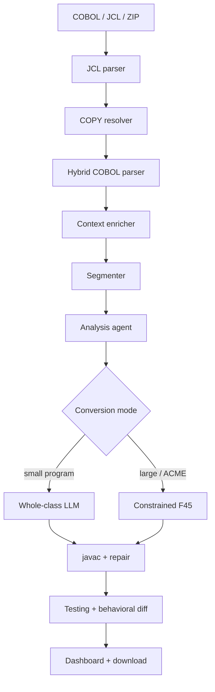

# COBOL Modernizer — Architecture Documentation

This folder is the **canonical architecture reference** for the implemented platform.
All code paths refer to `cobol-modernization-service/` unless noted otherwise.

---

## How to read these documents

Read in order for a full picture, or jump to a specific layer.

### Part 1 — Global view

| # | Document | What you learn |
|---|---|---|
| 01 | [System overview](./01-system-overview.md) | What the platform is, stack, core principles |
| 02 | [Pipeline and data flow](./02-pipeline-and-data-flow.md) | End-to-end stages, orchestration, pipeline modes |
| 03 | [Design decisions](./03-design-decisions.md) | Why staged pipeline, hybrid parser, two conversion modes |

### Part 2 — Pipeline components (in execution order)

| # | Document | Component |
|---|---|---|
| 04 | [JCL and COPY resolution](./04-jcl-and-copy-resolution.md) | `jcl_parser.py`, `copybook_resolver.py` |
| 05 | [COBOL parsing](./05-cobol-parsing.md) | `HybridCobolParser`, `ParserLayer`, parser JSON contract |
| 06 | [Context enrichment and segmentation](./06-context-enrichment-and-segmentation.md) | `ContextEnricher`, `CobolSegmenter` |
| 07 | [Analysis agent](./07-analysis-agent.md) | `AnalysisAgent`, LLM/deterministic engines |
| 08 | [Java conversion](./08-java-conversion.md) | Whole-class vs constrained F45 mode |
| 09 | [Testing, validation, and download](./09-testing-validation-and-download.md) | Testing agent, behavioral diff, validation |
| 10 | [Project batch upload](./10-project-batch-upload.md) | ZIP upload, multi-file pipeline |
| 11 | [Frontend and API](./11-frontend-and-api.md) | Dashboard pages, workspace, API integration |

### Reference (contracts and extension)

| Document | Purpose |
|---|---|
| [API reference](./reference/api-reference.md) | Endpoints, request schemas, config defaults |
| [Schema contracts](./reference/schema-contracts.md) | JSON shapes between pipeline stages |
| [Developer guide](./reference/developer-guide.md) | Code layout, how to extend the engine |

---

## System at a glance



## Active components map

| Layer | Class / module | Location |
|---|---|---|
| Orchestration | `PipelineService` | `app/services/pipeline_service.py` |
| API routes | `modernization`, `testing` | `app/api/routes/` |
| JCL | `parse_jcl` | `app/parsers/jcl_parser.py` |
| COPY | `resolve_copybooks` | `app/parsers/copybook_resolver.py` |
| Parser (default) | `HybridCobolParser` | `app/parsers/hybrid_parser.py` |
| Heuristic core | `ParserLayer` | `app/parsers/cobol_parser.py` |
| Context | `ContextEnricher` | `app/parsers/context_enricher.py` |
| Segmenter | `CobolSegmenter` | `app/services/segmenter.py` |
| Analysis | `AnalysisAgent` | `app/agents/analysis_agent.py` |
| Conversion | `ConversionAgent` | `app/agents/conversion_agent.py` |
| Constrained mode | `run_constrained_generation` | `app/converters/constrained_generation.py` |
| Testing | `run_testing_agent` | `app/services/testing_agent.py` |
| Behavioral diff | `run_behavioral_diff` | `app/services/behavioral_diff_runner.py` |
| Validation | `ValidationService` | `app/validation/service.py` |
| Frontend | Next.js dashboard | `cobol-modernization-dashboard/` |

## Key runtime defaults

| Setting | Default | Meaning |
|---|---|---|
| `PARSER_BACKEND` | `hybrid` | Heuristic + ANTLR merge |
| `ANALYSIS_ENGINE` | `llm` | LLM semantic analysis |
| `JAVA_PROJECT_PROFILE` | `plain_java` | No Spring Boot |
| `PORT` | `8010` (handoff) | Backend API port |

## Design rule

```text
deterministic evidence first
  → explicit API contract
  → frontend displays real artifact
  → conversion uses only provided context
  → testing reports the result
```
