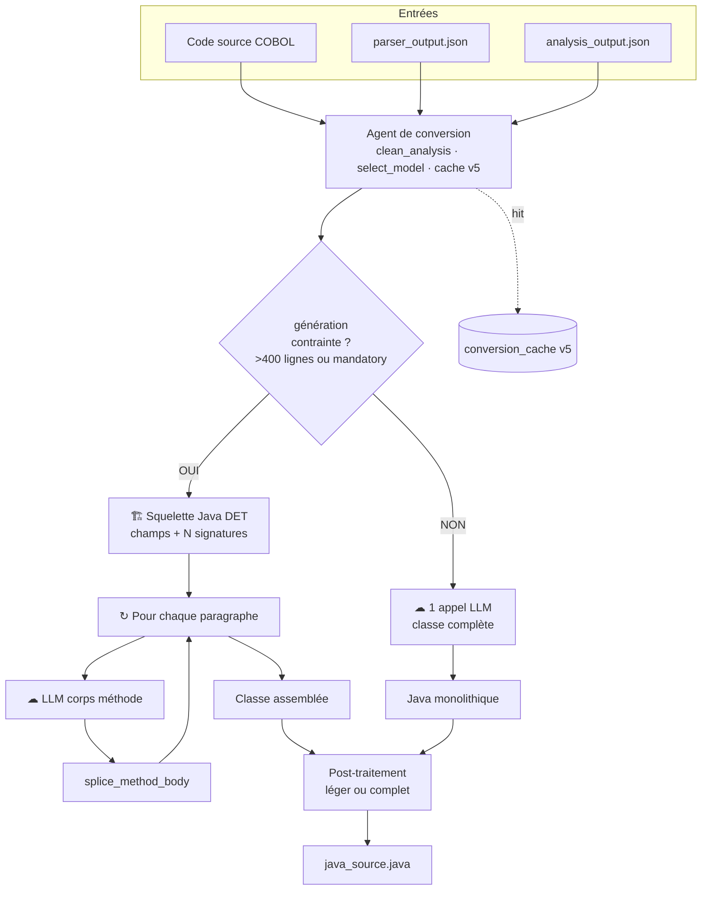

# Schéma — Agent de conversion (à reproduire dans Draw.io)

Guide pas à pas, **aligné sur le code** (juin 2026). Copier les libellés tels quels.

---

## 1. Palette recommandée

| Rôle | Couleur fill | Bordure | Forme Draw.io |
|------|--------------|---------|----------------|
| Entrées | `#FFF9C4` jaune | `#F9A825` | Parallélogramme |
| Agent / décision | `#E1BEE7` violet | `#7B1FA2` | Rectangle arrondi |
| Déterministe | `#C8E6C9` vert | `#2E7D32` | Rectangle + badge `DET` |
| LLM | `#E3F2FD` bleu | `#1565C0` | Rectangle + icône nuage |
| Post-process | `#FFE0B2` orange | `#E65100` | Rectangle |
| Sortie | `#A5D6A7` vert foncé | `#1B5E20` | Document |
| Cache | `#ECEFF1` gris | `#546E7A` | Cylindre |
| Losange décision | `#FFCDD2` | `#C62828` | Rhombus |

**Disposition :** portrait, ~1200×1600 px, flux **haut → bas**.

---

## 2. Vue d’ensemble (structure)

```
[Ligne 1]  3 entrées (côte à côte)
[Ligne 2]  Agent de conversion (large)
[Ligne 3]  Losange : génération contrainte ?
[Ligne 4a] Branche GAUCHE  = OUI  (contrainte)
[Ligne 4b] Branche DROITE  = NON  (monolithique)
[Ligne 5]  Barre de fusion (jonction)
[Ligne 6]  Post-traitement (2 variantes ou 1 avec notes)
[Ligne 7]  Cache (côté droit, pointillés)
[Ligne 8]  Sortie java_source.java
```

---

## 3. Boîtes — texte exact

### 3.1 Entrées (3 parallélogrammes, alignés horizontalement)

**E1 — Code source COBOL**
```
Code source COBOL
(vérité syntaxique — texte brut)
```

**E2 — parser_output.json**
```
parser_output.json
structure : paragraphes, symboles PIC,
control_flow, operations, risques
```

**E3 — analysis_output.json**
```
analysis_output.json
sens métier : rôles, business_rules,
complexity_tier, conversion_guidance
(produit par analyse + agrégation amont)
```

Flèches : E1, E2, E3 → **Agent de conversion** (3 flèches qui convergent).

---

### 3.2 Agent de conversion (rectangle violet, large)

```
┌─────────────────────────────────────────────────────────┐
│  AGENT DE CONVERSION                                     │
│                                                          │
│  Avant le LLM :                                          │
│  • clean_analysis_for_prompt()                           │
│  • get_chunk_rules() — règles filtrées par contexte      │
│  • select_model(complexity_tier)                         │
│      Standard → gpt-4o-mini  |  Complexe/Enterprise → gpt-4o │
│                                                          │
│  Cache : conversion_cache v5 (md5 source)                │
│  Si hit → retour Java sans rappeler le LLM               │
└─────────────────────────────────────────────────────────┘
```

**Note hors boîte (petit encadré à droite) :**
```
Le tier (Standard / Complexe / Enterprise)
choisit le MODÈLE, pas le mode
contrainte vs monolithique.
```

---

### 3.3 Losange central (sous l’agent)

```
        génération
      contrainte ?

Critères (déterministes) :
• programme > ~400 lignes COBOL
  OU liste « mandatory »
• PAS le tier Enterprise seul
```

**Branche gauche :** `OUI`  
**Branche droite :** `NON`

---

## 4. Branche OUI — Génération contrainte (F45)

Disposition **colonne gauche**, fond légèrement orange `#FFF3E0`.

### 4.1 Squelette (vert DET)

```
🏗 1. SQUELETTE JAVA — 100 % déterministe
   (aucun LLM)

• SymbolTable → champs, types (BigDecimal…)
• 1 paragraphe COBOL → 1 signature de méthode
• Ex. LOANEVAL : ~36 méthodes (variable selon programme)

Sortie intermédiaire : classe avec méthodes vides / stubs
```

### 4.2 Boucle (conteneur en pointillés)

Titre du conteneur :
```
↻ POUR CHAQUE paragraphe (N itérations)
```

À l’intérieur, 2 boîtes + 1 flèche retour implicite :

**Boîte LLM (bleu) :**
```
☁ 2. LLM — corps de méthode uniquement

• 1 appel API par paragraphe
• Prompt : COBOL du paragraphe + symboles locaux
  + règles de SA section (pas toutes les règles du programme)
• fast_mode : sanitize (compliance retry optionnel off par défaut)
```

**Boîte splice (vert clair) :**
```
🔩 splice_method_body()

Injecte le corps généré dans le squelette
à la place du stub du paragraphe
```

Flèche boucle : de splice → retour vers « paragraphe suivant » jusqu’à N.

### 4.3 Sortie branche OUI

```
Classe Java assemblée
(squelette + N corps de méthodes)
```

**Encadré « Pourquoi ? » (optionnel, italique) :**
```
Programme trop volumineux pour un seul prompt.
Précision : structure fixe + logique par morceau.
```

**Exemples programmes (petit texte, pas comme condition tier) :**
```
Ex. souvent contraint : LOANEVAL, RISKSCOR,
RPTMONTH, RECOVRY (si > seuil lignes)
```

---

## 5. Branche NON — Génération monolithique

Disposition **colonne droite**, fond bleu clair `#E3F2FD`.

### 5.1 Un seul LLM

```
☁ GÉNÉRATION MONOLITHIQUE

1 seul appel LLM

Prompt unique :
• COBOL complet (ou extrait majeur)
• parser_output (JSON)
• analysis_output nettoyé
• règles métier agrégées (~ordre de grandeur : dizaines)

→ Le modèle renvoie une classe Java entière
```

### 5.2 Sortie branche NON

```
Classe Java générée en une passe
```

**Encadré « Pourquoi ? » :**
```
Programme assez petit pour tenir
dans un seul contexte LLM.
Moins d’appels API, plus rapide.
```

**Exemples (petit texte) :**
```
Ex. souvent monolithique : petits batch,
modules < ~400 lignes, nombreux single-file
```

**⚠ Ne pas mettre ici :** RISKSCOR, RPTMONTH, RECOVRY (ils sont en contraint).

---

## 6. Fusion + post-traitement

Barre horizontale épaisse : **les deux branches rejoignent ici**.

### 6.1 Boîte post-process (orange)

```
POST-TRAITEMENT (_postprocess_conversion)

Variante selon chemin :

┌─ Contrainte (léger par défaut) ─────────────────┐
│ sanitize • profil Java • validations légères   │
│ (pas reconcile / sort / compile lourds)        │
└────────────────────────────────────────────────┘

┌─ Monolithique (complet) ────────────────────────┐
│ sanitize • repairs métier (CALL, SORT…)        │
│ reconcile symboles • compile_and_repair (javac)│
│ (sauf skip batch / flags env)                  │
└────────────────────────────────────────────────┘

┌─ Cas spécial AUTOPREM ──────────────────────────┐
│ Référence Java COBOL-faithful                  │
│ Skip repairs destructifs (dangling chains…)     │
└────────────────────────────────────────────────┘
```

### 6.2 Cache (cylindre à droite, flèche pointillée depuis l’agent)

```
conversion_cache v5
clé : v5_{PROGRAM}_{hash COBOL}

« bypass LLM si déjà converti »
```

---

## 7. Sortie finale

Document vert :
```
java_source.java

+ notes de réparation
+ quality_score (scoring_service)
→ envoyé au Testing Agent
```

---

## 8. Mermaid (référence rapide — import draw.io ou copie concept)



---

## 9. Checklist avant de présenter

- [ ] Losange OUI : **taille / mandatory**, pas « Enterprise »
- [ ] RISKSCOR / RPTMONTH / RECOVRY **pas** sur branche monolithique
- [ ] `select_model` lié au **tier**, pas au losange
- [ ] Cache **v5**, pas v2
- [ ] Post-process : **2 niveaux** (léger vs complet)
- [ ] Mention amont : `analysis_output` vient de **chunks agrégés** (hors de ce schéma ou petite note en E3)

---

## 10. Note une ligne pour slide voisin (optionnel)

En bas du canvas, petit texte gris :

```
Amont (hors schéma) : Parser → Analyse (segmenter → chunker → agrégateur)
→ analysis_output utilisé ici. L’agrégateur ne assemble pas le Java.
```

---

*Fichier compagnon de `PRESENTATION-ARCHITECTURE-DRAWIO.md` — schéma conversion corrigé.*
